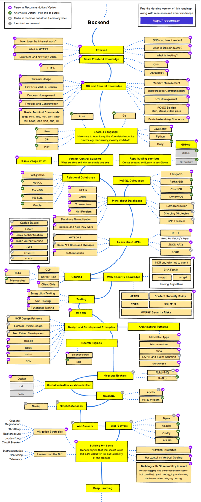

# 백엔드로드맵
참고링크
[백엔드 개발자 로드맵](https://roadmap.sh/backend)

---
백엔드 로드맵이다.   
**하나하나 정리하면서 앞으로 나아가고자한다.**

나는 처음 개발을 시작할때 어떻게 시작해야할지 몰라서, 백엔드 로드맵을 쳐다보지도 않았었다. 
봐도 이해하기 힘들고, 왜 이 순서대로 알아야하는지 필요성을 느끼지도 못했으니까 말이다. 

 

하지만, 웹프로그래머를 목표로 공부를 하다보니까, 
중간중간에 모호하게 알고있는 개념이나, 부족한 부분이 계속 나와 진도가 막히게 되는 경우가 다소 생긴다. 
이런 일을 겪고나서 다시 한번 로드맵을 보니, 그제서야 필요성을 느끼게 되었고, 
확실히 개념을 잡아두기위해 블로그로 기록하고자 한다.

 

 

추가적으로 백엔드 개발자를 목표로 나아가고 있는 분들에게 

좋은 동기부여 및 참고한 만한 내용을 담은 링크를 남기겠다.   
[벡엔드개발자를 꿈꾸는 학생개발자에게](https://d2.naver.com/news/3435170)
