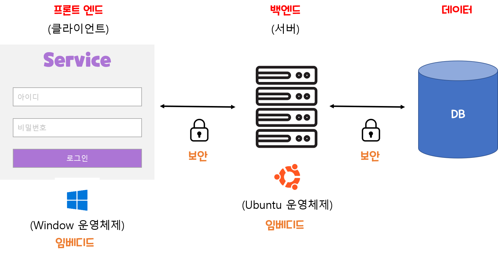

# 개발자 직군에 대한 고찰
코딩을 배우고, 개발을 배우는 이유는 개발자가 되고 싶어서이다.   
그런데 정작 어떤 개발자가 있는지, (흔히 아는프론트엔드인지- 백엔드인지만 고민했지)
나는 어떤 개발자가 되고 싶은지 구체적으로 생각을 해보지 않은 것 같다. 

## 카카오 예시
이번에 2022여름 채용연계형 인턴십을 하길래 모집공고를 읽어봤다.    
총 9주간(약 2달)간 진행이되며, 모집분야를 나눠서 개발자들의 일하는 방식과 문화를 경험할 수 있게 된다. 

### 모집분야 
모집분야는 크게 4가지로 나누고, 상세분야로 구분되어 모집하였다. 

- Infra : Infra 개발/ System Engineering / Network Engineering
- Data : Data Engineering / Data Science(ML/Statistics)/ Data Platform Engineering
- Server :  Server
- Client : iOS / Android / Front-End / Windows

물론 개발 분야가 위 분야가 전부는 아니지만, 그래도 이것들 위주로 알아보고자 한다.

---

## 직업군 알아보기 
#### Infra? Data? Server? Client? 이게 대체 먼데?
저는 개발자 종류를 크게 5가지로 나눠봤다. 
프론트엔드, 백엔드, 데이터베이스, 임베디드, 보안 

이중 임베디드와 보안을 제외하고 
프론트엔드와  벡엔드 ,데이터 베이스 그리고 추가적으로 Infra를 알아보자 

  

### 1. 프론트엔드
서비스를 만든 사람이 아닌 사용자가 볼수 있는 화면을 보통 client라고 말하는데, 
이 client를 구현하는 개발자를 프론트엔드라고한다. 

#### 1-1. 프론트엔드 종류 
각 운영체제마다 각자 다른 기술과 방법을 요하므로 분류는 크게 4가지로 나뉜다.
 - 웹
 - 앱(iOS,Android)
 - PC(Window, Mac)
 - 게임

  

### 2. 데이터 
사용자 정보, 서비스정보, 관리자 정보등 다양한 정보를 보관하고 관리하는 장소를 DB(DataBase)라고 하는데,
사용자가 2~3명 뿐이라서 정보가 별로 없는 경우라면 크게 상관없지만, 100명, 10000명 , 수십만명으로 넘어가게되면 
효율적으로 정보를 관리할 필요가 생긴다.
이런 관리를 하는 개발자를 데이터개발자라고 한다. 

#### 2-1. 데이터 개발자 종류 
 - 데이터 엔지니어()
 - 데이터 사이언티스트(통계기반 분석)
 - AI 엔지니어 (비지니스 적용)
 - AI 연구원(모델 개발)
#### 2-2. 각 종류 부연설명 
1. 데이터 엔지니어 (Data Engineering)
    - 위에서 이야기한 효율적인 정보관리를 위하여 데이터를 수집하고 관리하는 개발자를 말한다.
    - 흔히 ETL(추출-Extract, 변환-Transform, 적재-Load) 테이블을 설계하고 구축한다. 
    - 추가적인 데이터 수집이 있을수 있기 때문에 확정성 높게 설계하는게 중요하다.
2.데이터 사이언티스트(Data Science(ML/Statistics))
   - **빅데이터**를 토대로 미래를 예측하고 모델링 하는 개발자를 말한다.  
   - 서로 연결되지않은 다수의 데이터로 부터 데이터를 탐구하고 실험한다.
   - 보통 비즈니스에 적용할 데이터를 예측할때 많이 적용합니다.
 
3. AI 연구원, AI 엔지니어 
    - 빅테이터를 활용하여 인공지능에게 학습시켜 결과를 내릴수 있게 컴퓨터 시스템을 구현하는 개발자이다. 
    - 사람들이 쉽게 놓칠수있거나, 도저히 확인할 수 없는 영역을 AI를 통해 구현한다.(ex. 사기 감지, 의료등)

4. 데이터 플랫폼 엔지니어
    - 데이터플랫폼이란?: 용량이 크고 복잡한 동적데이터를 대상으로 분석을 수행해야하는 서비스와 기술로 구성된 에코시스템

  

### 3.Infra(인프라)
Infra는 "infrastructure(사회기반시절)"의 줄임말로, 필요한 기반시설을 만드는 일을 말한다.    
그렇기에 인프라 개발자는 전체적인 개발흐름    
즉, 하드웨어, 운영체제, 네트워크, 미들웨어를 다 알고 있어야 한다. 그래야 기반/설계가 가능하다

#### 3-1. 인프라 개발자 업무 
인프라 엔지니어의 업무는 크게 **설계, 구축, 운영**으로 나눠진다. 
1. 인프라 설계 
    - 인프라를 만든 목적이 있으므로 우선, 그 목적을 잘 이해해야된다.
    - 목적을 달성하기 위해 필요한 기능, 성능 조건등 기준을 정한다. 
    - 조건이 정리되면 이에 맞는 기획서와 설계도를 작성한다. 
    - 예상소요시간 과 예상비용도 측정한다.
2. 인프라 구축
    - 필요한 기능이나 소프트웨어등을 발주해서 납품받으면 인프라 구축을 시작한다.
       - 필요한 기능을 직접 구현할 수도 있으나 외주업체에 맡길수도 있다.
    - 만들고 가져온 기능들은 설정하고 설치하고, 동작테스트/부하테스트를 수행한다. 
3. 인프라 운영
    - 구축한 IT인프라는 가동후에 정상적으로 동작하도록 운영해야한다.
    - 인프라는 24시간,365일 내내 가동되야하기에 교대하면서 상시 관리하는것이 일반적
    - 주로 장애대응, 수용량 관리, 인프라가 원인이 아닌 문제파악

  

#### 4.백엔드
데이터와 클라이언트 사이에서 데이터을 송수신하면서 정보를 교환하는데 이과정을 보통 응답과 요청이라고 한다.
백엔드 개발자는 보통 이 응답과 요청을 구현하는 일을 한다. 
- 흔히 사용자가 너무 몰려 서버가 터지면, 수습하는것이 백엔드 개발자이다. 
- 

