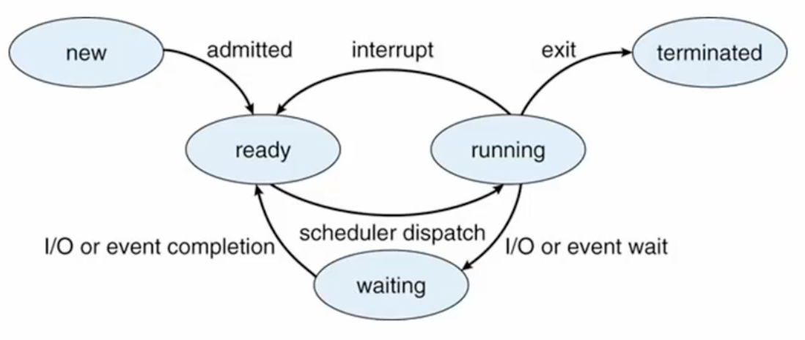
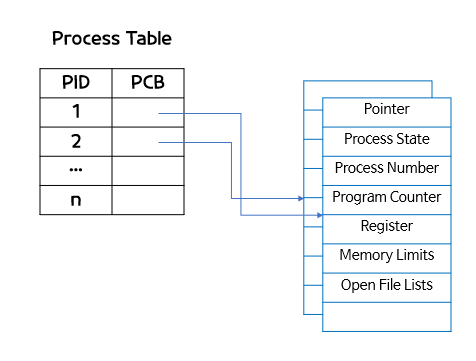
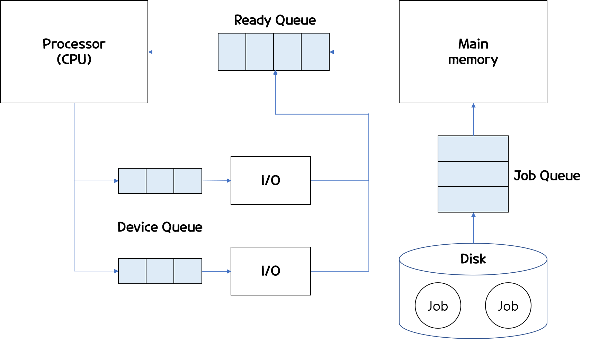

# 프로세스 관리

## 프로세스(Process)란?
사전적 뜻으로는 보통 "과정"이라고 쓰인다.   
하지만, 운영체제에서의 프로세스는 메인 메모리에 적재되어 CPU에서 **실행중인 상태인 프로그램을 말한다.**   
프로그램은 일반적으로 하드디스크에 저장되어 있는데, 저장되어 있는 동안에는 아무 일도 하지 않는 상태이다. 
프로그램을 실행하기 위해선, 메인 메모리에 할당 시키게 되는데 이상태가 되어야 프로세스라고 부른다.    
- 프로세스는 실행하면서 stack, pointer, data, text, register등이 끊임없이 변한다.
- Job, task등으로 불리기도 한다.

  
## 프로세스의 구성요소

### 1. 컴파일된 프로그램 코드 (code)
 - 텍스트 섹션에 저장된다. 

### 2. 프로그램 카운터(PC)
 - 다음에 실행될 명령어의 주소를 가지고 있어, 실행될 기계어 코드의 위치를 저장한다. 
 - 즉, 다음에 실행될 명령어 포인터라고 할 수 있다. 

### 3.CPU레지스터 내용

### 4.프로세스 Stack
 - 함수에서 사용되는 데이터 정보를 저장한다. 
 - 즉, 함수 매개변수(Parameter), 함수 내부에서 사용되는 지역변수, 복귀 주소(return address)가 저장된다. 
 - 함수 호출이 완료되면 메모리 해제가 된다.

### 5.데이터 섹션
 - 전역변수나 정적변수(static 변수)가 저장된다.
 - 프로그램 시작 시 동시 할당 되고, 종료시 해제된다.

### 6.힙(Heap)
 - 개발자가 필요에 의해 동적으로 할당하는 메모리 
 - 할당해야할 메모리를 런타임에 결정할 수 있는 경우, 유용하게 사용된다.

  

## 프로세스 상태(Process State)
 - New : 프로그램이 메인 메모리에 할당(프로세서 생성)
 - Ready : 할당된 프로그램이 초기화와 같은 작업을 통해 실행되기 위한 모든 준비된 상태(실행되기 전 기다리는 상태)
 - Running : CPU가 해당 프로세스를 실행 상태
 - Waiting : 프로세스가 끝나지 않은 시점에서 중단하고 어떤 event(입출력완료, signal수신 등)가 발생하기를 기다리는 상태
 - Terminated : 프로세스가 종료된 상태

## PCB(Process Control Block)
- PCB는 프로세스에 대한 모든 정보가 모여있는 곳으로, Task Control Block(TCB)이라고도 불린다.  
- PCB는 운영체제가 프로세스를 제어하기위해 정보를 저장해놓은 것으로 프로세스의 정보를 저장하는 자료구조이다. 
- PCB안에는 **프로세스의 상태**, 프로세스 번호(PID), 해당 프로세스의 program counter(PC), register값, MMU정보 ,CPU 점유시간 등이
포함되어 있다. 
- PCB는 운영체제 내부의 프로세스를 관리하는 코드 부분에 저장되어 있다.

## 프로세스를 기다리는 줄 3가지 
프로그램이 프로세스가 되기 위해서는 메인 메모리로 올라가야한다.      
하지만, 메인 메모리에는 공간이 한정되어 있어 메모리의 적당한 공간이 없을 경우 줄을 기다려야 한다. 

 

### 1. Job Queue
하드디스크에 있는 프로그램이 실행되기 위해  할당 순서를 기다리는 줄을 Job Queue라고 한다. 
 - Process Queue는 Process Scheduler에 의해 관리된다. 
 - Process Scheduler는 Long-term Scheduler라고도 불리는데 다른 프로세스가 모든 작업을 끝낼 때까지
   기다려야 하므로 기다리는 시간이 상대적으로 오래 걸리기 때문

### 2. Ready Queue
상태가 Ready에 있는 프로세스 들은 CPU에 할당 받기 위해 줄을 서고 있는데 그 줄을 Ready Queue라고 불린다.
 - CPU의 점유 순서를 기다리는 줄을 말한다.
 - CPU Scheduler에 의해 관리된다.
 - Short-term-scheduler라고도 불린다.

### 3. Device Queue
하드디스크나 I/O의 할당을 받기위해서도 프로세스는 줄을 서는데 이 줄을 Device Queue 라고 한다.
 - Device scheduler에 의해 제어가 된다.
 - 각 장치 마다 기다리는 큐가 각각 존재한다. 
 

