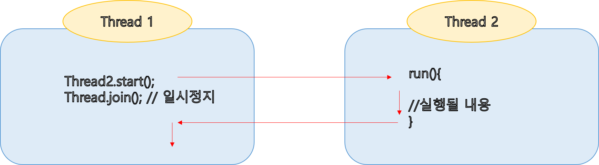
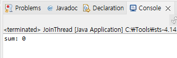
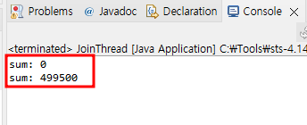
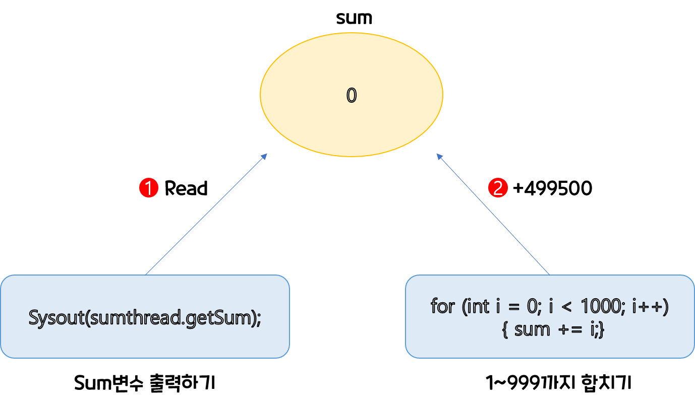
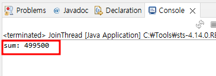

# 스레드 상태
스레드로 객체를 생성하면 우선 **실행 대기 상태**로 들어갑니다.   
- 실행대기 상태란 아직 스케쥴링 전 즉 코어에서 작업을 할당받지 못한 상태    

**실행 대기 상태**에 있는 스레드 중 스레드 스케쥴링으로 선택된 스레드가 CPU를 점유하고 run()을 실행하여 **실행 상태**가 된다.
- 이때 실행상태란 CPU를 점유하고 있는 상태

아직 run()메소드가 끝나지 않아도 스레드 스케쥴링에 의해 다시 실행 대기 상태로 돌아가며 번갈아 가면서 내용을 끝낼 때까지 지속한다.    
경우에 따라 run중인 스레드를 **일시정지** 시킬수도 있다.
- 가장 많이 쓰이는 예제는 slepp()메서드 같은 경우 
- 일시정지 후에는 다시 **실행 대기 상태**로 간다.

<p align = center></p>
## 스레드 상태 제어
실행중인 스레드 상태를 변경하는 것을 **스레드 상태 제어**라고 한다.
**멀티 프로그램을 만들기 위해서는 정교한 스레드 상태 제어가 필요하다.**   

### 실행대기 yield() 테스트
먼저 테스트에 필요한 yield() 메소드를 실행할 쓰레드를 2개 만든다. 
- yieldThreadTest1.java
``` 
public class yieldThreadTest extends Thread {
	private boolean stop = false;
	private boolean button = true;
	
	public void setLoopStop(boolean stop) {
		this.stop = stop;
	}
	
	public void setButton(boolean button) {
		this.button = button;
	}
	
	public void run() {
		while(!stop) {
			try {
				Thread.sleep(1);
			} catch (InterruptedException e) {
				// TODO Auto-generated catch block
				e.printStackTrace();
			}
			if(button) {
				System.out.println("첫번째 Tread가 동작중...");	
			}
			else {
				Thread.yield();
			}
  	}
	}
}
```
- yieldThreadTest2.java
```
public class yieldThreadTest2 extends Thread {
	private boolean stop = false;
	private boolean button = true;

	public void setLoopStop(boolean stop) {
		this.stop = stop;
	}

	public void setButton(boolean button) {
		this.button = button;
	}

	public void run() {
		while (!stop) {
			try {
				Thread.sleep(1);
			} catch (InterruptedException e) {
				// TODO Auto-generated catch block
				e.printStackTrace();
			}
			if (button) {
				System.out.println("두번째 Tread가 동작중..."); //이부분만 다르다.
			} else {
				Thread.yield();
			}

		}
	}

}
```

- 그리고 실행할 main.java
```
		yieldThreadTest thread1 = new yieldThreadTest();
		yieldThreadTest2 thread2 = new yieldThreadTest2();

		thread1.start();
		thread2.start();

		thread1.setButton(false); // 첫번째 yield() 실행

		try {
			Thread.sleep(1000);
		} catch (InterruptedException e) {
			// TODO Auto-generated catch block
			e.printStackTrace();
		}

		thread1.setButton(true); // 첫번째 다시 실행
		thread2.setButton(false); // 두번째 yield() 실행

		try {
			Thread.sleep(1000);
		} catch (InterruptedException e) {
			// TODO Auto-generated catch block
			e.printStackTrace();
		}

		// 스레드 종료
		thread1.setLoopStop(true);
		thread2.setLoopStop(true);
```
- 결과
<p align = center></p>

yield()메소드가 첫번째에 실행되었을땐 두번째스레드(Thread2)만 실행이되고,    
yield()메소드가 두번째에 실행되었을땐 첫번째스레드(Thread2)만 실행이 된다.    


### 일시정지 join() 테스트
스레드는 다른 스레드와 독립적으로 실행하는 것이 기본이지만, 간혹 다른 스레드가 종료될 때까지 기다렸다가 실행해야하는 경우가
발생할 수 있다.    
예를 들어 계산 작업을 하는 스레드가 모든 계싼 작업을 마쳤을 때, 계산 결과값을 받아 이용해야 하는 경우 같이
이런 경우에는 Thread.join()메소드를 사용한다.   
Thread1이 Thread2의 join() 메소드를 호출하면, Thread1은 Thread2가 종료할 때까지 일시 정지 상태가 된다. 

<p align = center></p>

### Join()메소드를 사용하지 않았을 때 
- SumThread.java 
```
public class SumThread extends Thread {
	private long sum;

	public long getSum() {
		return sum;
	}

	public void run() {
		for (int i = 0; i < 1000; i++) {
			sum += i;
		}
	}
}
```
-JoinTest.java
```
public class JoinTest {
	public static void main(String[] args) {
		SumThread sumthread = new SumThread();
		sumthread.start();

		System.out.println("sum: " + sumthread.getSum());
	}

}
```
- 결과값
<p align = center></p>


- 위처럼 결과 값은 0이 나온다. 이유는 쓰레드가 동시에 실행되어, sumThread 값안에 sum값이 0일때  mainThread가 접근을 하여
- 0을 반환하는 것이다.

- JoinTest.java
이번엔 아래와 같이 값출력을 두번하게되면, SumThread가 이미 run메소드 안에 있는 명령문을 실행하여 
1~999까지 값을 전부 합한 499500이 출력된다. 
```
public class JoinTest {
	public static void main(String[] args) {
		SumThread sumthread = new SumThread();
		sumthread.start();

		System.out.println("sum: " + sumthread.getSum());
		
		System.out.println("sum: " + sumthread.getSum());			
	}
}
```
 - 결과값
<p align = center></p>

<p align = center></p>

	 (물론 중간에 부하를 걸어줘서 sum 값이 1275, 5253, 11781등 중간값이 나오게 할 수도 있다.)

그럼 이번엔 join()메소드를 이용하여, 일시정지 기능을 사용해보자
- SumThread.java(위와 동일)

- JoinTest.java
```
public class Jointest {
	public static void main(String[] args) {
		SumThread sumthread = new SumThread();
		sumthread.start();
		try {   // 추가된 부분
			sumthread.join(); // symthread가 종료될때까지 기다림
		} catch (InterruptedException e) {
			// TODO Auto-generated catch block
			e.printStackTrace();
		} // 추가된 부분
		
		System.out.println("sum: " + sumthread.getSum());

	}

}
```
 - 결과값
<p align = center></p>


