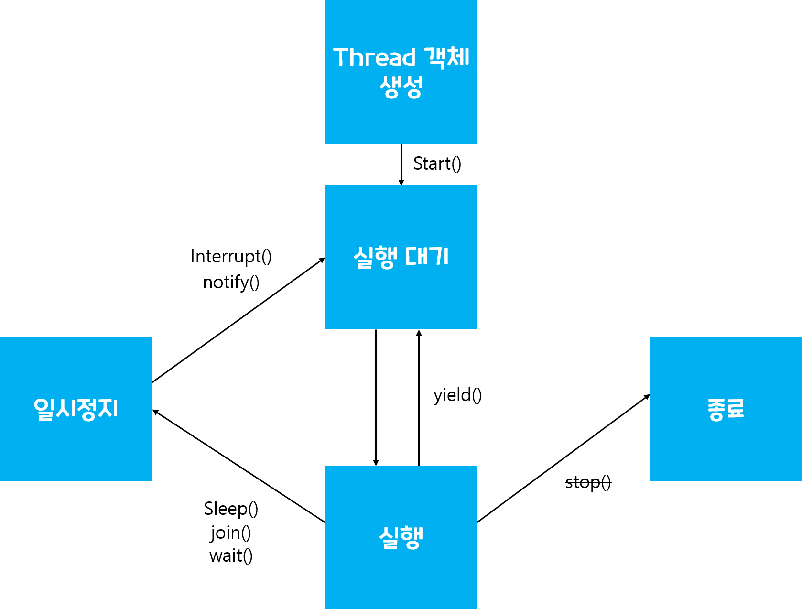
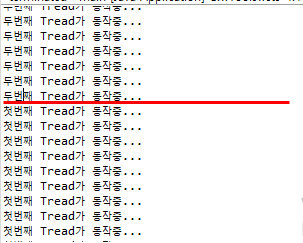

# 스레드 상태
스레드로 객체를 생성하면 우선 **실행 대기 상태**로 들어갑니다.   
- 실행대기 상태란 아직 스케쥴링 전 즉 코어에서 작업을 할당받지 못한 상태    

**실행 대기 상태**에 있는 스레드 중 스레드 스케쥴링으로 선택된 스레드가 CPU를 점유하고 run()을 실행하여 **실행 상태**가 된다.
- 이때 실행상태란 CPU를 점유하고 있는 상태

아직 run()메소드가 끝나지 않아도 스레드 스케쥴링에 의해 다시 실행 대기 상태로 돌아가며 번갈아 가면서 내용을 끝낼 때까지 지속한다.    
경우에 따라 run중인 스레드를 **일시정지** 시킬수도 있다.
- 가장 많이 쓰이는 예제는 slepp()메서드 같은 경우 
- 일시정지 후에는 다시 **실행 대기 상태**로 간다.

<p align = center></p>
## 스레드 상태 제어
실행중인 스레드 상태를 변경하는 것을 **스레드 상태 제어**라고 한다.
**멀티 프로그램을 만들기 위해서는 정교한 스레드 상태 제어가 필요하다.**   

### 실행대기 yield() 테스트
먼저 테스트에 필요한 yield() 메소드를 실행할 쓰레드를 2개 만든다. 
- yieldThreadTest1.java
``` 
public class yieldThreadTest extends Thread {
	private boolean stop = false;
	private boolean button = true;
	
	public void setLoopStop(boolean stop) {
		this.stop = stop;
	}
	
	public void setButton(boolean button) {
		this.button = button;
	}
	
	public void run() {
		while(!stop) {
			try {
				Thread.sleep(1);
			} catch (InterruptedException e) {
				// TODO Auto-generated catch block
				e.printStackTrace();
			}
			if(button) {
				System.out.println("첫번째 Tread가 동작중...");	
			}
			else {
				Thread.yield();
			}
  	}
	}
}
```
- yieldThreadTest2.java
```
public class yieldThreadTest2 extends Thread {
	private boolean stop = false;
	private boolean button = true;

	public void setLoopStop(boolean stop) {
		this.stop = stop;
	}

	public void setButton(boolean button) {
		this.button = button;
	}

	public void run() {
		while (!stop) {
			try {
				Thread.sleep(1);
			} catch (InterruptedException e) {
				// TODO Auto-generated catch block
				e.printStackTrace();
			}
			if (button) {
				System.out.println("두번째 Tread가 동작중..."); //이부분만 다르다.
			} else {
				Thread.yield();
			}

		}
	}

}
```

- 그리고 실행할 main.java
```
		yieldThreadTest thread1 = new yieldThreadTest();
		yieldThreadTest2 thread2 = new yieldThreadTest2();

		thread1.start();
		thread2.start();

		thread1.setButton(false); // 첫번째 yield() 실행

		try {
			Thread.sleep(1000);
		} catch (InterruptedException e) {
			// TODO Auto-generated catch block
			e.printStackTrace();
		}

		thread1.setButton(true); // 첫번째 다시 실행
		thread2.setButton(false); // 두번째 yield() 실행

		try {
			Thread.sleep(1000);
		} catch (InterruptedException e) {
			// TODO Auto-generated catch block
			e.printStackTrace();
		}

		// 스레드 종료
		thread1.setLoopStop(true);
		thread2.setLoopStop(true);
```
- 결과
<p align = center></p>

yield()메소드가 첫번째에 실행되었을땐 두번째스레드(Thread2)만 실행이되고,    
yield()메소드가 두번째에 실행되었을땐 첫번째스레드(Thread2)만 실행이 된다.    


