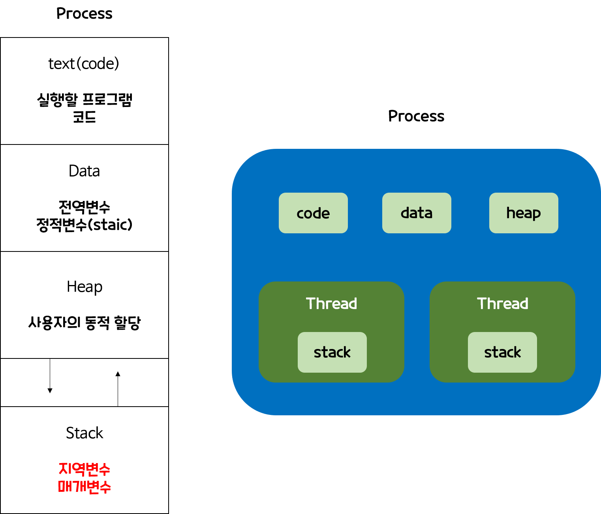

# 쓰레드(Thread)


## 1. 프로세스 생성과 종료 
 - (1)프로세스는 프로세스에 의해 만들어진다. 
 - (2)컴퓨터가 부팅이 되면 운영체제가 메모리에 올라오는데   
 - (3)운영체제가 처음으로 수행하는 일 중에 하나는 최초의 프로세스를 생성하는 것이다.    
이렇게 처음 만들어진 프로세스가 다른 프로세스를 만들고 그 프로세스가 또다른 프로세스를 만드는 과정을 반복한다. 

    
    위와 같이 최초의 프로세스는 Init이다. 
    이 이름은 운영체제마다 다르고, init은 UNIX 운영체제 기준의 이름이다. 
    여기서 여러 다른 프로세스들이 생성되면 위와 같은 그림처럼 트리모양으로 나타낼 수 있다.
    여기서 프로세스를 생선한 쪽을 부모 프로세스, 만들어진 프로세스를 자식 프로세스라고 한다. 
    같은 부모를 갖는 자식 프로세스 끼리는 서로 Sibling(형제)프로세스 라고 한다.
    
    


## 쓰레드(thread)란?
 - 프로세스 내에서 실제로 작업을 수행하는 주체를 의미한다. 
 - 모든 프로세스에는 한개 이상의 스레드가 존재하여 작업을 수행한다. 
 - 두개 이상의 Thread를 가지는 프로세스를 Multi-Threaded process(멀티쓰레드 프로세스) 라고 한다.
 ```
 int main(void){
   int n = 0;
   int m = 10;
   Systems.out.println("곱셉값 : "+ n*m);
   while(n < m){
      n++;
   }
 return n*m;
 }
 ```
 위와 같은 코드는 하나의 흐름을 가지고 있는 쓰레드이다. 
일반적으로 프로그램을 만들 때 보통 main쓰레드를 하나는 꼭 가지고 시작한다.

 
 ### 다중 쓰레드(MultiThreads)
 - 하나의 프로그램에 쓰레드가 2개이상 존재하는 것을 다중 쓰레드라고 한다. 
 - 이렇게 여러개의 쓰레드 즉, 흐름이 있을 수 있는 이유는 쓰레드가 빠른 시간 간격으로 스위칭되기 때문이다. (MultiTasking)
     - 이 덕에 사용자는 여러 쓰레드가 동시에 실행되는 것 처럼 보인다. 
 - CPU가 하나일 때 여러 쓰레드가 스위칭에 의해 동시에 수행되는 효과를 concurrent(병행성)
 - CPU가 여러개일 때 여러 쓰레드가 실제로 동시에 수행되는 것은 simultaneous(동시성) 
 - 현재는 CPU 코어수도 늘리고, CPU가 여러쓰레드를 처리하는 위 두가지 경우를 같이 사용할 수 있는 상태이며,     
<br></br>
다중 쓰레드를 사용하는 대표적인 예시는 Web Brower이다.(그외에도  word process, Media player등) 
 - 화면을 출력하는 쓰레드
 - 데이터를 읽어 오는 쓰레드

### 다중 쓰레드 장점
이전의 CPU 스케줄링에서 하나의 프로세스가 수행하다가 다른 프로세스로 넘어간다고 했었는데, 이는 예전의 방식이다.    
현재 운영체제는 대부분 다중 쓰레드를 지원하기 때문에, 하나의 프로세스 안에서 여러 쓰레드를 수행하다가 다른 프로세스로 넘어가서도 그 프로세스의 쓰레드를 수행한다.    
그러므로 현대 운영체제의 **Context switching 단위는 프로세스가 아닌 쓰레드 단위** 이다.
 - CPU의 사용률 향상
 - 자원을 효율적으로 사용
 - 사용자에 대한 응답성 향상
 - 작업이 분리되어 코드의 간결성 향상

### 다중 쓰레드 주의할 점
 - 여러쓰레드가 같은 프로세스 내에서 자원을 공유하면서 작업을 하기 때문에,    
 - 발생할 수 있는 동기화(Synchronization), 교착상태(deadlock) 문제들을 고려해서 프로그래밍을 해야한다.


## 쓰레드와 프로세스 관계
<p align =center></p>
