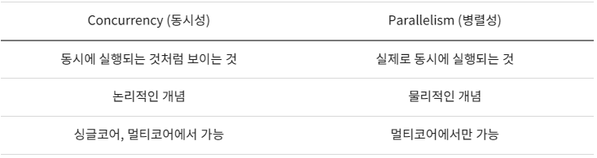
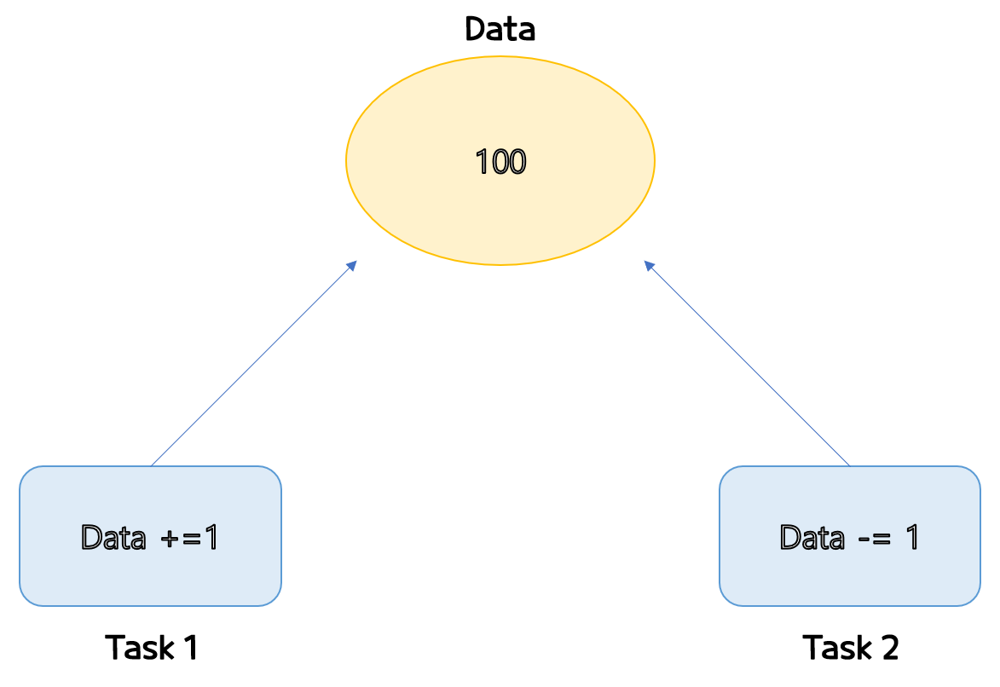
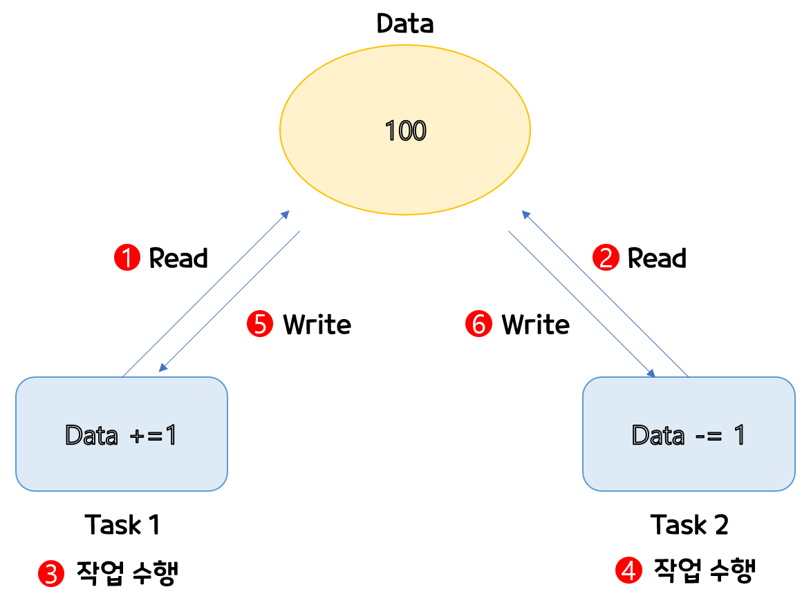

# 동시성과 병렬성 

Concurrency(동시성) , parallelism(병렬성)은 헷갈리기 쉬운 개념이다. 이번에 명확히 짚고 넘어가고자한다.

 요약

## Parallelism
- Parallelism은 여러 코어에서 여러 작업을 동시에 수행하는 것
- 코어가 하나밖에 없다면 병렬적으로 프로그램을 실행할 수가 없다.
- 하나의 코어에서 하던 작업을 세개의 코어에서 나누어 하니 이론적으로는 성능이 3배까지 좋아질 수 있다. 
- 하지만 여러작업을 동시에 수행하니 race condition 혹은 동기화 문제가 발생 할 수 있다. 

## Concurrency
- 빠르게 전환하며 여러작업을 수행하여 동시에 여러 작업이 실행되는 것처럼 보이는 것
- 한개의 코어에서도 여러작업을 실행할 수 있고, 작업 간에는 Context Switch 가 일어난다.

## 동기화문제 
- 동기화 문제는 Concurrent한 Task 사이에서 발생한다.
   - 즉, 여러 작업이 동시에 공유된 자원에 접근하려 할 대 발생한다. 
 
 (ex) 쉽게 그림으로 예를 들어보자 

 - 원래대로라면 Data에 1을 더하고, 다시 1을 뺐으니 작업이 끝나면 Data값이 100이여야 한다. 
 - 하지만, **동기화 문제가 발생하면** Data에 99혹은 101이 들어가 있을 수 있다. 
 
 (ex)보다 더 자세히 들어가보자 

 
 > ① Task1이  Data에 100을 읽어 온다.  
 > ② Task2이  Data에 100을 읽어 온다.  
 > ③ Task1에서 100에 1을 더한다.  
 > ④ Task2에서 100에 1을 뺀다.  
 > ⑤ Task1이 결과값을 Data에 적는다.  
 > ⑥ Task2이 결과값을 Data에 적는다.  

- 위 결과값은 99가 나올것이다. 
- 위와 같이 Task가 동시에 접근하게되면 문제가 발생한다. 그래서 이를 막기 위한 **동기화 기법**을 사용해줘야 한다.

# Thread 우선순위 
멀티스레드는 동시성 또는 병렬성으로 실행이 된다.   
코어의 수보다 스레드 수가 적으면 각각의 코어로 병렬성이 보장되지만, 스레드의 개수가 코어보다 많은 경우 
스레드를 어떤 순서에 의해 동시적으로 실행할 것인가를 결정해 주어야 한다.
 - 순서를 정해주는 것을 **스레드 스케줄링**이라 한다.
 - 이런 스케줄링 방식은 우선순위(priority) 방식과 순환 할당(Round-Robin) 방식으로 나뉜다.

## 우선순위(Priority)방식
우선순위가 높은 스레드가 실행을 더 많이 하도록 스케줄링하는 방법이다.    
코드에서도 우선순위를 정해줄수 있는데 숫자의 크기가 우선순위의 정도를 나타낸다.
 - thread.setPriority(1) // 1 - 우선순위가 가장 낮음
 - thread.setPriority(10)// 10 - 가장 높음
숫자로는 헤깔릴수 있기에, 직관적인 상수로 변환하여 처리한다. 
 - thread .setPriority(Thread.MAX_PRIORITY); //MAX_PRIORITY = 10
 - thread .setPriority(Thread.MIN_PRIORITY); //MIN_PRIORITY = 1

## 순환할당(Round-Robin)방식 
**시간 할당량**을 정해서 하나의 스레드를 정해진 시간만큼만 실행하는 방법이다.   
해당 방식은 JVM안에서 이루어지기에 개발자가 제어할 수 없다.

