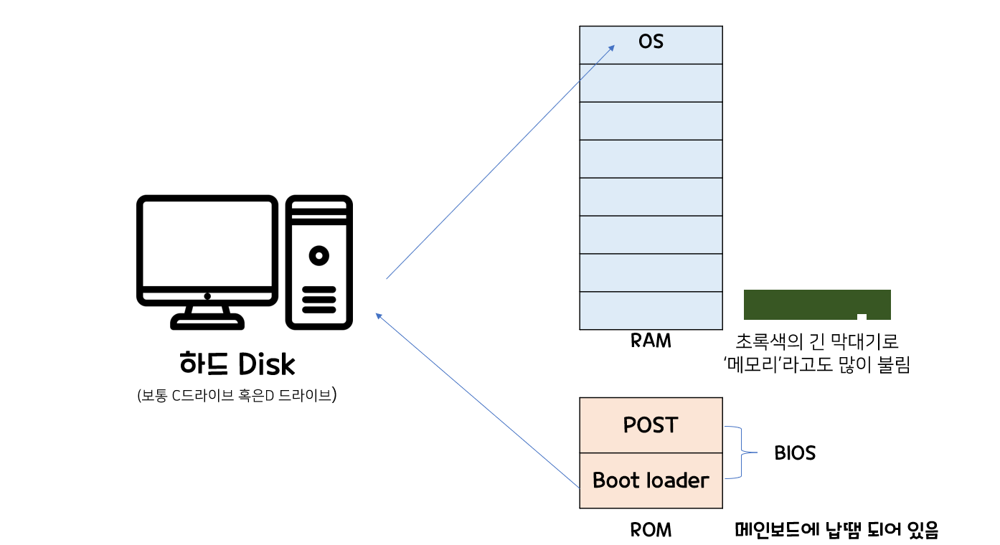
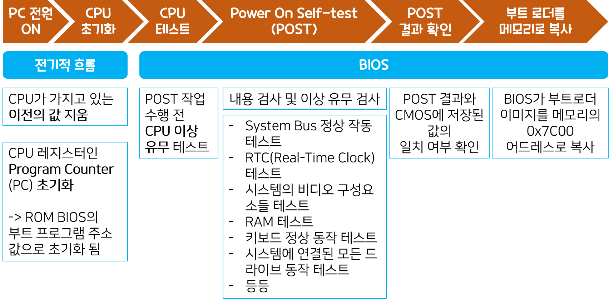
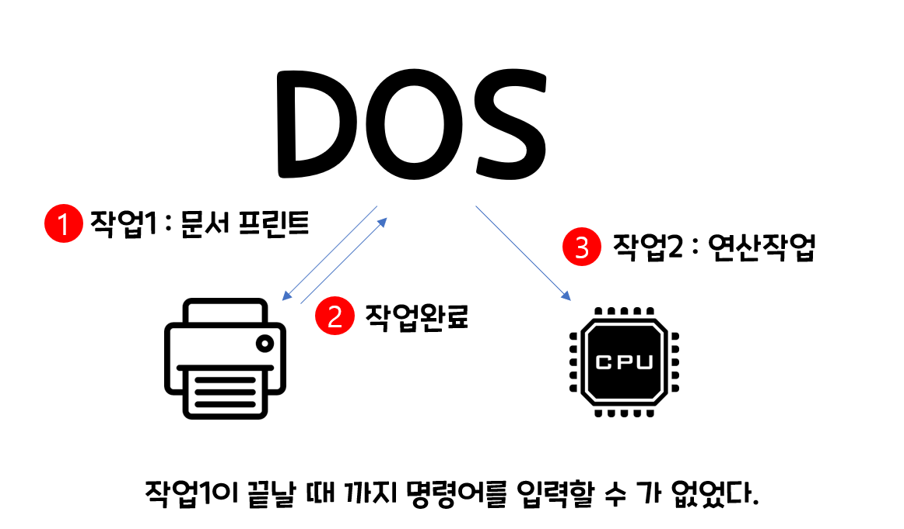
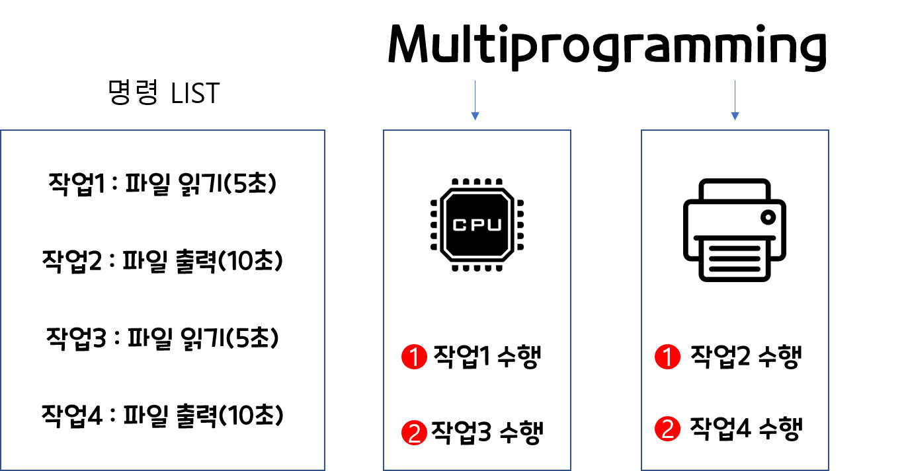
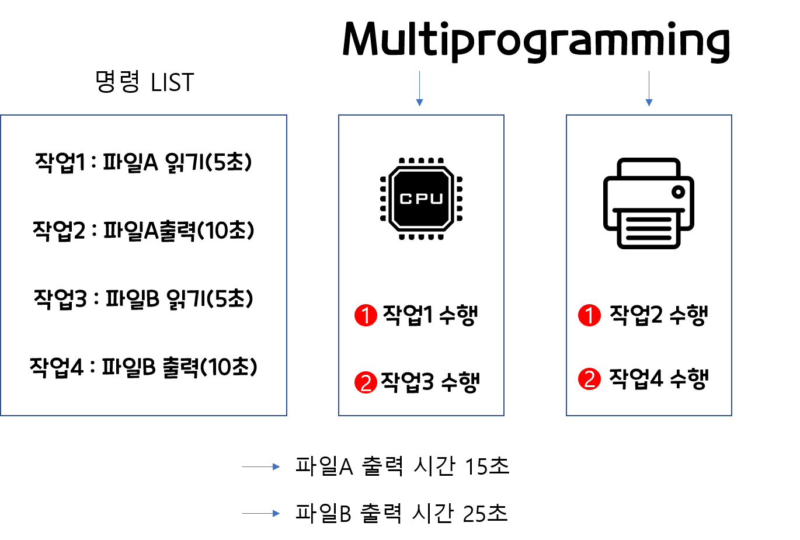
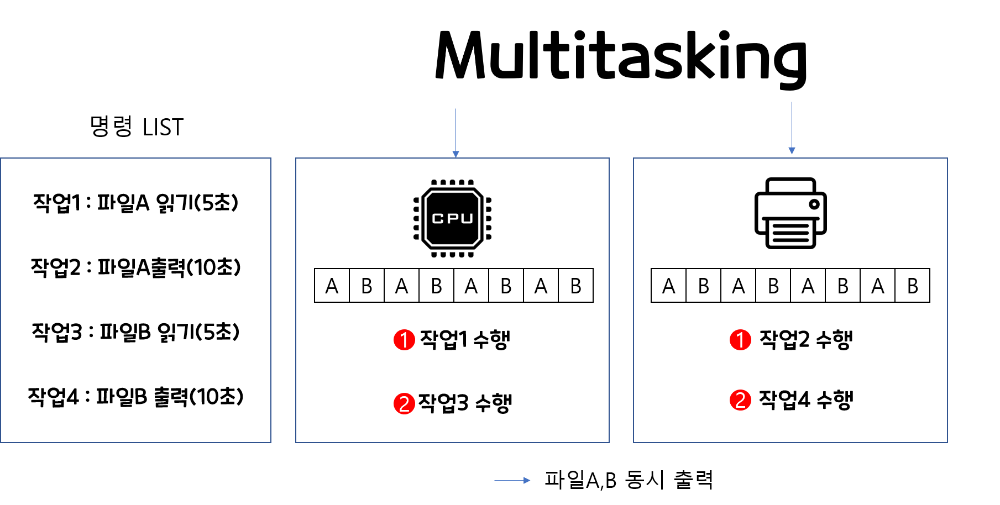

# 운영체제란? 
- Operating System을 줄여서 OS라고도 부르며, 컴퓨터 하드웨어(입출력 장치, CPU)의 리소스를 관리해주면서 동시에 여러 Application이 작동할 수 있는 환경을 제공해주는 소프트웨어이다
- 우리가 흔히 알고있는 Mac, Linux, Windows, Unix 등이 있다. 
- OS는 프로그램들이 리소스를 필요로 할 때 리소스를 할당해준다. 
- OS는 각각 자원을 할당받은 프로그램들이 서로 엉키지 않고 효율적으로 작동하도록 제어해준다. 

## 운영체제(OS)가 하는 일(역할)
OS는 프로그램들이 자원을 필요로 할때 자원을 할당 해줍니다.(여기서 자원은 CUP 시간, 메모리공간, 파일저장공간 등)   
OS는 각 자원을 할당 받은 프로그램들이 서로의 영역을 침법하지 않게 하고, 컴퓨터의 부적절한 사용을 방지하는 **제어프로그램**의 역할을 합니다.  

이처럼 컴퓨터에서 프로그램들이 돌아가기위해선 자원(resource)이 필요합니다.   
하지만, 자원이 한정되어 있기에 효율적으로 관리해주는 것이 바로 OS의 역할입니다.

## 운영체제의 부팅 과정 
  
  
 - 컴퓨터는 기본적으로 전원이 있어야 실행이 됩니다.
 - 그런데 전원이 나가게 되면, 데이터가 날아갈 수 있기 때문에 기본적으로 CPU는 ROM에 정보를 보관합니다. 
 - ROM안에는 POST(Power On Self-Test)와 부트로더(BootLoader)가 저장되어 있습니다.  
    - POST는 컴퓨터 전원이 켜지면 가장 먼저 실행되, 컴퓨터가 이상이 있는지 체크하는 프로그램
    - BootLoader는 하드디스크에 저장되어 있는 OS프로그램을 가져와서 RAM에 넘겨주는 프로그램
  
### 1. Boot Loader(부트 로더)
 - **운영체제를 시동시켜주는 프로그램**
 - 커널이 올바르게 시동되기 위해 필요한 모든 관련 작업을 하는 곳   
 
 
 - 아래 그림은 부트로드 전 단계까지 설명된 그림

 
 - 만약 BIOS가 부팅 가능한 모든 장치를 검사했는데도 부트로더를 찾을 수 없다면 BIOS는 'Operating System Not Found'와 같은 메시지를 출력하고 작업을 중단한다.
  

  

## Intertupt(인터럽트)
컴퓨터가 부팅이 되면 OS 프로그램을 실행한 후 사용자의 입력 이벤트를 기다린다. 
 - 바로 이 이벤트가 인터럽트라고 한다.
 - OS가 가지고 있는 **관리기능** 이다.
 - ex) 컴퓨터를 부팅시키면 바탕화면이 나오기 전에 화면 보호기처럼 생긴 화면이 먼저 나올 것이다. 비번을 걸어놓았다면 비밀번호 입력창이 뜰것이고, 아무것도 설정 안했다 하더라도 마우스 혹은 키보드로 클릭해야 바탕화면으로 넘어가는 것을 본적이 있으실 것이다. 
    - 이것이 입출력장치라는 interrupt를 기다리게 되며, 그동안 OS는 아무 행동도 취하지않고 대기 상태가 된다.   

### 1.인터럽트 과정
인터럽트가 발생되면 OS는 **해당 명령어 주소를 저장한다.**    
그 이유는 인터럽트가 발생하면 하던일을 중단하고 인터럽트에 대응하는 행위를 먼저 끝내고 돌아와야 하기 때문에, Interrupt의 대응하는 행위를 끝내고 다시 그 다음 명령어를 수행하거나 다시 대기 상태로 돌아오기 위함이다. 

### 2.인터럽트가 필요한 이유 
 - 결론부터 말하자면 주변장치와 입출력장치는 연산이 CPU나 메모리에 비해 명령 수행 속도보다 현저히 느리기 때문이다.
 - 만약 입출력 연산을 CPU가 매번 기다리는 상황이 나타난다면, 컴퓨터의 처리 속도는 비효율적이게 되기 때문이죠.
 - 그래서 운영체제는 CPU가 기다리지말고, 입출력장치의 연산결과가 나올 때까지 다른일을 수행하도록 하고, 입출력장치가 작업이 완료되면, 
   CPU에게 알려 미리하던 일을 멈추고 기존에 하던일을 처리할 수 있게 하는 기능이다.
   
### 3.인터럽트의 종류
크게 하드웨어 인터럽트와 소프트웨어 인터럽트로 나눌 수 있다.
하지만 일반적으로 인터럽트라고 하면 하드웨어 인터럽트를 가르키는 경우가 많다.

#### 3-1. 하드웨어 인터럽트 
CPU 외부의 디스크 컨트롤러나 주변 장치로 부터 요구되는 것으로, 운영체제의 처리를 요하는 상황을 알리기위해 전기적인 신호를 사용해 구현된다.
 - 기계검사 Interrupt : 프로그램을 실행하는 도중 갑작스런 정전이나, 컴퓨터 자체 내에서 기계적인 문제가 발생한 경우
 - 외부 Interrupt : 오퍼레이터나 타이머에 의해 의도적으로 프로그램을 중단한 경우
 - 입출력 Interrupt : 입출력의 종료나 입출력의 오류에 의해 CPU의 기능이 요청되는 경우(마우스, 키보드 입력)
 - 프로그램 검사 Interrupt : 프로그램 실행중 보안적으로 문제가 되는 명령수행이 발생한 경우

#### 3-2. 소프트웨어 인터럽트
외부가 아닌 CPU내부에서 자신이 실행하는 명령이나 CPU의 명령 실행에 관련된 모듈이 변화하는 경우 발생한다. 
보통 처리 불가능한 오류나 이벤트를 알리기 위한 경우에 발생하는데, 이를 트랩(trap)혹은 **예외(Exception)**이라 부른다.
 - 0으로 나누는 계산
 - 존재하지 않는 메모리에 접근했을 때
 - 계산 결과가 Overflowm, Underflow 발생할 때
  

  
## 운영체제의 발전
예전 DOS시절 운영체제에서는 자원의 효율성이 떨어졌었다.    
흔히 쓰이는 Termainal 혹은 windows 의 cmd 창처럼 생긴 DOS는   
멀티태스킹이 되질 않았었거든요.   
  
이게 무슨 말인지 예를 들자면,   
짜장면 배달부가 2곳을 배달을 가야하는데,  
1번째 집에 배달하고, 1번째집에서 짜장면을 다먹을때까지 2번째 집에 배달을 가지않고 기다리는 경우를 말합니다.   

즉, CPU가 1번째 작업을 다른 장치에게 맡기고 놀구 있음에도, 2번째 작업으로 넘어가지 않는 비효율적인 구조였던거죠.  

그래서 Multiprogramming을 생각합니다. 

## Multiprogramming
말그대로 여러 작업들이 동시에 메모리에 올라가게 됩니다. 

이덕에 노는 자원없이 효율적으로 운영이 되었지만, 아쉽게도 이 방법도 한계가 있었죠..  

바로 작업들마다 자원의 사용에 **시간차이**가 생긴다는 것이였습니다.   
 - 예를 들어 명령어로 파일A을 읽고 출력하고, 파일B를 읽고 출력하는 명령어가 입력이 되었다고 가정해봅시다.    
 - 그럼,먼저 파일 A를 5초동안 읽고 입출력장치로 넘겨서 10초 동안 출력을 합니다. 
 - 파일B도 5초 이후에 5초동안 읽기 시작해서 CPU는 10초만에 연산을 마칩니다. 
 - 하지만 입출력 장치는 명령어가 떨어지고 5초이후 부터 10초간 출력을 해야하기에 끝나고 나서야 파일 B를 10초간 출력해야합니다.    
 - 그래서 명령이 들어온 시간은 같지만, 파일 A는 15초, 파일B는 25초에 받아볼 수가 있죠   

그래서 등장한 것이 Multitasking 입니다.

## Multitasking
멀티태스킹은  멀티 프로그래밍의 논리의 확장이라고 보면됩니다.
각각의 작업에 시간을 부여하고 CPU를 작업하다가 그 시간이 지나가면 다른 작업에게 CPU 자원을 할당해줍니다.
그러므로 위와 같은 시간 지연으로 인한 낭비를 줄일 수 있으며 주어진 시간은 굉장히 짧아서 빈번한 
Switching이 발생합니다. 

