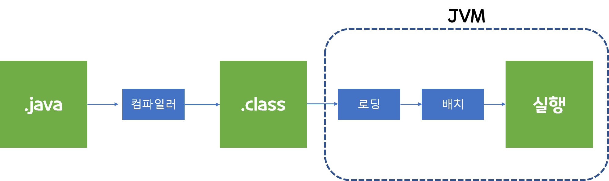
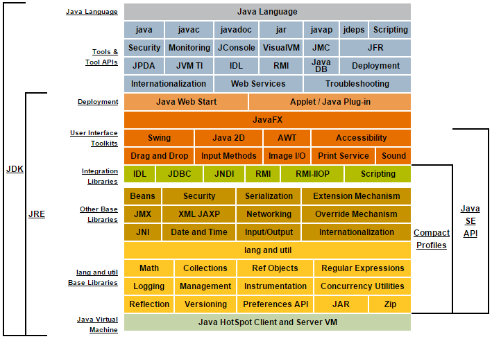
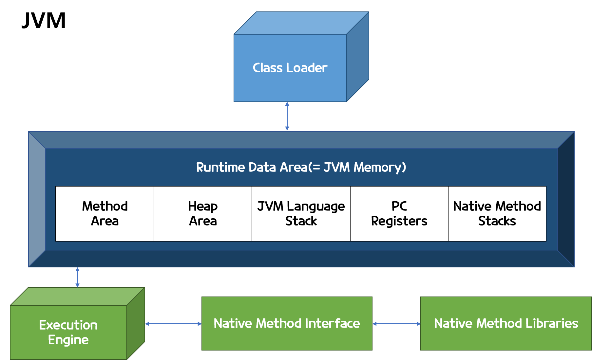
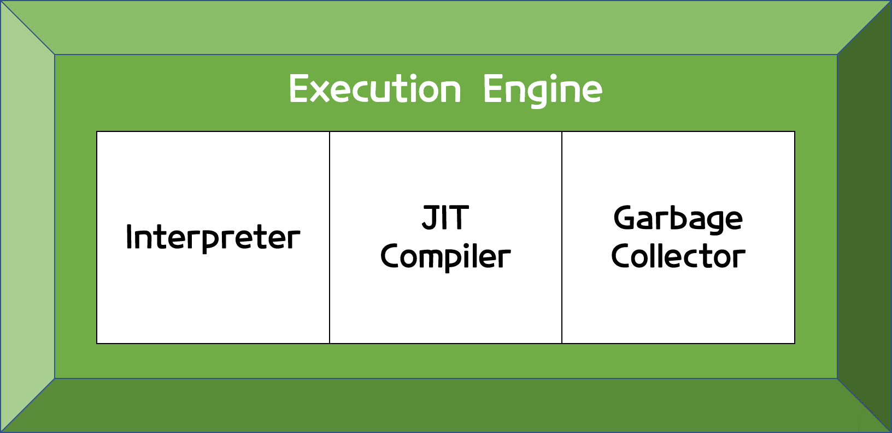
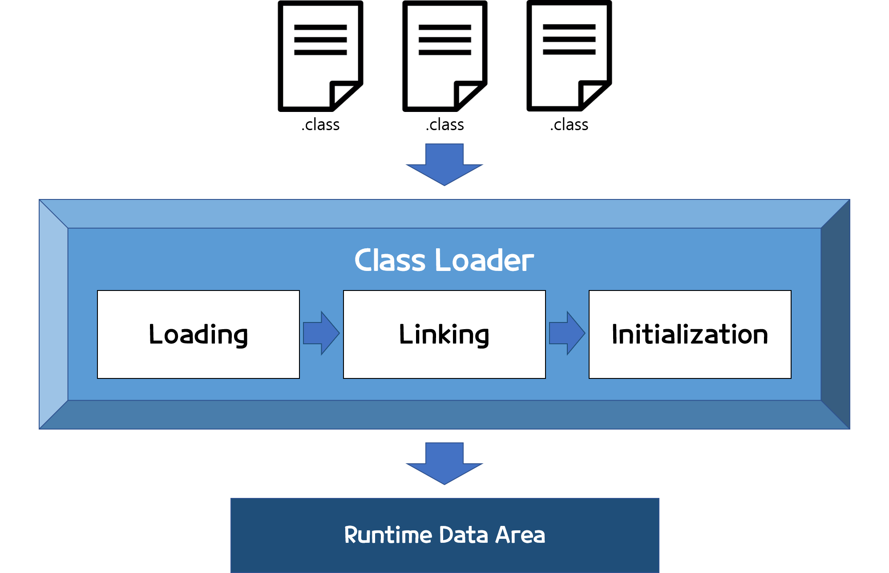

# 자바의 구조
## java의 process 
자바 프로그램이 실행되는 과정은 아래와 같다.

 
위 과정으로 보면 다소  복잡해 보이는데,  크게 3가지로 나눌수 있다. 
- 자바 파일(.java), 자바 바이트코드(.class), 자바가상머신(JVM)
- 그럼 아래와 같이 간소화하여 표현할 수 있다.

### 1. 자바 컴파일 작업
- 자바 컴파일러는 자바를 가지고 작성한 자바 소스 코드를 자바 가상머신이 이해할 수 있는 **자바 바이트코드(=class파일)로 변환**한다.
- 자바를 설치하면 javac.exe라는 실행 파일이 있는데, 이것이 컴파일러 실행파일이다.

### 2. 자바 바이트 코드(.class)
- 자바 가상머신이 이해할 수 있는 언어로 변환된 자바 소스코드 이다.
- 확장자는 .class파일이다.
- 이 파일은 자바 가상 머신만 설치되어 있으면, 어떤 운영체제에서라도 실행할 수 있다. 

### JVM(자바 가상머신)
-  자바 바이트 코드를 실행시키기 위한 가상의 기계
-  대부분의 주요 운영체제는 물론이고, 웹 브라우저, 스마트폰, 가전기기등에서도 JVM을 설치하여 사용가능하다. 
   - 다만, 운영체제에 종속적이고, 한단계가 더 생기기에 상대적으로 실행속도가 느리다.
- 자바의 메모리 구조를 알기위해선 JVM의 구조를 잘알아야 할 필요가 있다. 

## JDK의 구조 
그럼 우리가 실제로 코드를 작성하는 파일은 .java파일이며, JDK의 영향을 가장 많이 받는 곳이기도 하다.   
그 다음 컴파일되는 작업에서는 JRE의 영향을 가장 많이 받는다. 

- 위와 같이 JDK는 JRE를 포함하고 있으며, JRE 밖의 JDK들은 개발자가 코드를 작성하는데 직접적으로 필요한 것들이다.
- Java를 실행하고 싶다면, JDK만 설치하면 된다.
  - 물론, 코드를 직접 작성하여 파일을 만드는 것은 에디터를 설치해야한다.(이클립스나 인텔리J 등)

# JVM의 구조
크게 4가지로 구성되어 있다. 
 - 자바 인터프리터(interpreter)
 - 클래스 로더(class loader)
 - JIT 컴파일러(Just-In-Time Compiler)
 - 가비지 컬렉터(garbage collector)

## 자바 어플리케이션 실행과정 
1. 어플리케이션이 실행되면 JVM이 OS로 부터 메모리를 할당받음
    - JVM은 할당받은 메모리를 용도에 따라 영역을 구분하여 관리
2. 자바 컴파일러(javac.exe)가 자바 소스코드(.java)를 읽어 바이트 코드(.class)로 변환
3. Class Loader를 통해 바이트 코드를 JVM으로 로딩 
4. 로딩된 바이트 코드는 Execution Engine을 통해 해석됨
5. 해석된 바이트 코드는 Runtime Data Areas에 배치되어 실행됨
    - 실행되는 과정에서 GC(Garbage Collector)같은 작업이 수행됨

## Execution Engine
 - JVM의 구성요소 4가지중 3가지를 포함하고 있다.   
 - Runtime Data Area(= JVM 메모리)에 할당된 바이트 코드를 실행시켜주는 주체이다.

### Interpreter(통역사)
 - 바이트 코드를 해석하여 실행하는 역할을 수행
 - 다만 같은 메소드라도 여러번 호출될때 매번 새로 수행해야 함

### JIT(Just In Time) Compiler
 - Interpreter의 단점을 해소
 - 반복되는 코드를 발견하여 전체 바이트 코드를 컴파일하고 그것을 Native Code로 변경하여 사용
    - 여기서 Native는 자바에서 부모가 되는 C언어, C++, 어셈블리어를 의미한다. 
### Garbage Collector 
- 더이상 참조되지 않는 메모리 객체를 모아 제거하는 역할을 수행
- 일반적으로 메모리가 일정 영역이 차게되면 자동으로 실행되지만,    
   수동으로 실행하기 위해 'system.gc()'를 사용할 수 있음(다만, 실행이 보장되지 않음)

#### Garbage
 - 앞으로 사용되지 않는 객체의 메모리를 Garbage라고 부름
 - 이런 Garbage를 정해진 스케줄에 의해 정리해주는 것을 GC(Garbage Collector)라부름
1. Stop The World 
   - GC를 수행하기 위해 JVM이 멈추는 현상을 의미
   - GC가 작동하는 동안 GC관련 쓰레드를 제외한 모든 쓰레드는 멈춤
   - 일반적으로 '튜닝'이라는 것은 이 시간을 최소화 하는 것을 의미함.
2. GC의 종류
   - Serial GC
   - Parallel GC
   - CMS GC
   - G1 GC
   - Z GC

## Class Loader

참고자료 : tcpschool.com
