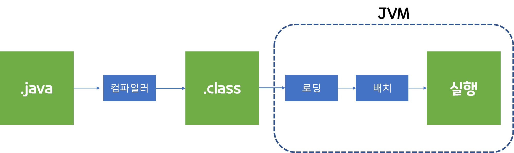

# 자바의 구조
## java의 process 
자바 프로그램이 실행되는 과정은 아래와 같다.

 
위 과정으로 보면 다소  복잡해 보이는데,  크게 3가지로 나눌수 있다. 
- 자바 파일(.java), 자바 바이트코드(.class), 자바가상머신(JVM)
- 그럼 아래와 같이 간소화하여 표현할 수 있다.

### 1. 자바 컴파일 작업
- 자바 컴파일러는 자바를 가지고 작성한 자바 소스 코드를 자바 가상머신이 이해할 수 있는 **자바 바이트코드(=class파일)로 변환**한다.
- 자바를 설치하면 javac.exe라는 실행 파일이 있는데, 이것이 컴파일러 실행파일이다.

### 2. 자바 바이트 코드(.class)
- 자바 가상머신이 이해할 수 있는 언어로 변환된 자바 소스코드 이다.
- 확장자는 .class파일이다.
- 이 파일은 자바 가상 머신만 설치되어 있으면, 어떤 운영체제에서라도 실행할 수 있다. 

### JVM(자바 가상머신)
-  자바 바이트 코드를 실행시키기 위한 가상의 기계
-  대부분의 주요 운영체제는 물론이고, 웹 브라우저, 스마트폰, 가전기기등에서도 JVM을 설치하여 사용가능하다. 
   - 다만, 운영체제에 종속적이고, 한단계가 더 생기기에 상대적으로 실행속도가 느리다.
- 자바의 메모리 구조를 알기위해선 JVM의 구조를 잘알아야 할 필요가 있다. 

## JDK의 구조 
그럼 우리가 실제로 코드를 작성하는 파일은 .java파일이며, JDK의 영향을 가장 많이 받는 곳이기도 하다.   
그 다음 컴파일되는 작업에서는 JRE의 영향을 가장 많이 받는다. 

- 위와 같이 JDK는 JRE를 포함하고 있으며, JRE 밖의 JDK들은 개발자가 코드를 작성하는데 직접적으로 필요한 것들이다.
- Java를 실행하고 싶다면, JDK만 설치하면 된다.
  - 물론, 코드를 직접 작성하여 파일을 만드는 것은 에디터를 설치해야한다.(이클립스나 인텔리J 등)

## JVM의 구조
크게 4가지로 구성되어 있다. 
 - 자바 인터프리터(interpreter)
 - 클래스 로더(class loader)
 - JIT 컴파일러(Just-In-Time Compiler)
 - 가비지 컬렉터(garbage collector)

참고자료 : tcpschool.com
