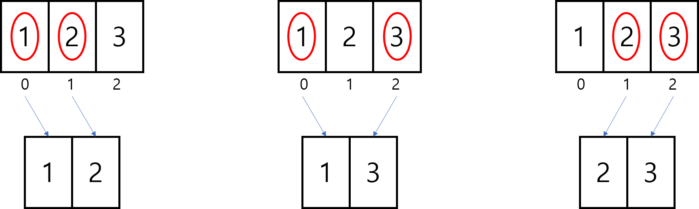

# 조합(Combination)

## 조합이란? 
 - 임의의 집합에서 순서가 없이 선택하는 것을 말한다. 
 - 총 N개의 집합에서 R개 만큼 순서없이 뽑는 경우의 수
    - 예를 들어 {1,2,3} 집합에서 2개의 원소를 선택한 조합을 구하시오. 
    - {1,2}, {1,3},{2,3}으로 총 3가지 경우의 수가 나온다. 
 - 보통 수학적 공식으로   n**C**r    형태로 많이 쓰이며 , 공식은 아래와 같다. 
 <p align= center></p>
 
 

## 조합 경우의 수 알고리즘
 1.  n**C**r 의 경우  n/r * n-1**C**r-1 로 나눌수 있다.
 <p align= center></p>
 
 2.  이 경우를 반복하여 r이 1이 될때 까지 반복한다. 
 3.  r이 1이라는것은 m개중에 1개 만 선택하는 것임으로 m을 리턴하면 된다.    

	  - 여기서 r이 1이 되려면  r-r+1이다.
    <p align= center></p>

 4. 이러한 형태로 다음 재귀함수에 넘겨준다.
 

```
public class Combination {
	public static void main(String[] args) {
		System.out.println(combinationCase(4, 2));
	}

	public static double combinationCase(int n, int r) {// n = 총갯수 ,r = 선택갯수
		if (r == 1) {
			return n - r + 1;
		} else {
			return (double) n / r *  combinationCase(n - 1, r - 1);
		}
	}
}
```
> 여기서 double로 안하면, n/r식에서 소수점자리가 다 버려진다. 

<br></br>

## 조합 각 집합 출력하기
이제 경우의 수 말고 뽑아져 나오는 조합을 출력해보자 

 ### 조합구현 
 - 조합은 순열에 비해 로직을 더 고민해봐야한다. 아시다시피 프로그래밍언어는 인덱스가 존재하기에, 순서가 있는 경우가 오히려 로직을 구하기 쉽다.
```
	public static ArrayList<ArrayList<Integer>> combination(int[] arr, int n, int r) {

		ArrayList<ArrayList<Integer>> comb = new ArrayList<>();

		for (int i = 0; i < n; i++) {
			ArrayList<Integer> element = new ArrayList<>();

			element.add(arr[i]);
			for (int j = i + 1; j < n; j++) {
				if (element.size() == r) {
					continue;
				}
				element.add(arr[j]);
				System.out.println(element);
			}
			if (element.size() == r) {
				comb.add(element);
			}
		}
		return comb;
	}
```


 - 하지만, 조합의 경우는 순서를 중요시하지 않기 때문에 중복을 허용하지않는다.(방문목록을 만들어 주자)
   <p align= center></p>
<br></br>
---
 - 위와같이 뽑을려면, 기본적으로 현재 인덱스보다 작아지면 안된다는 것을 알 수 있다.
 - 그리고, 조합은 한번 뽑으면 r의 갯수를 하나 줄여줘도 된다.(r==0일때 출력해주면 됨)
 
