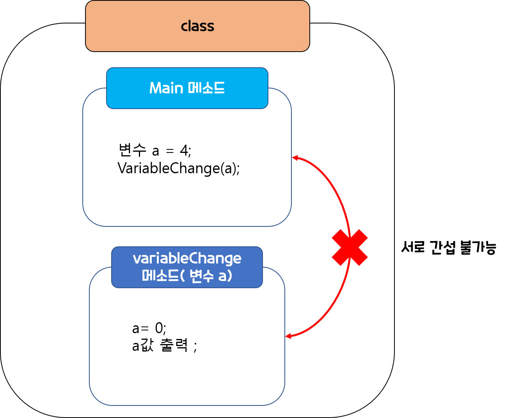
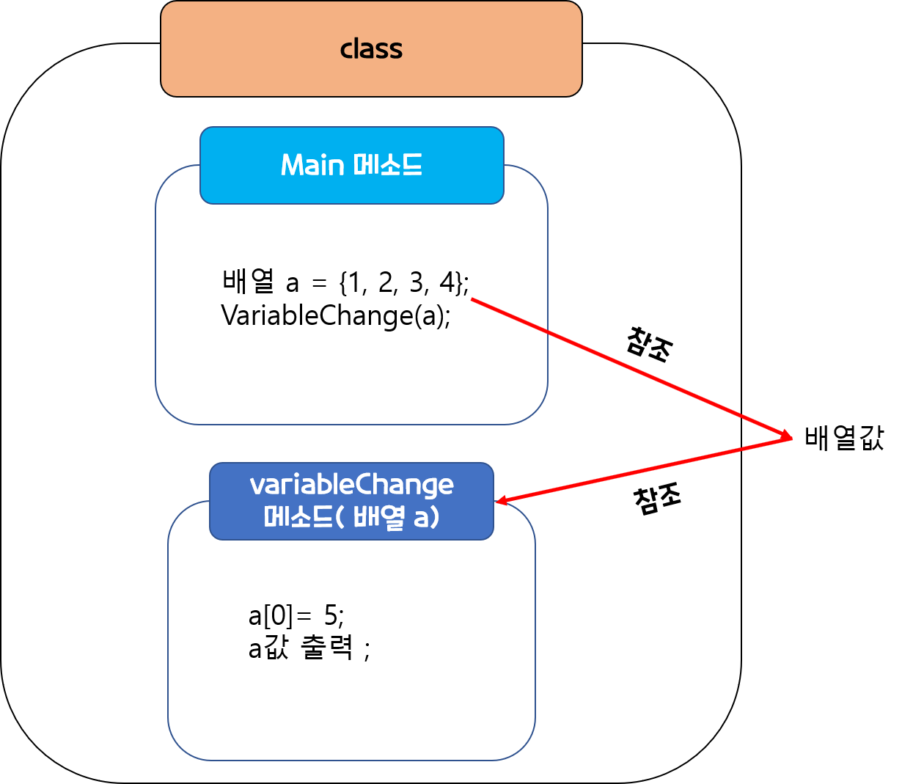
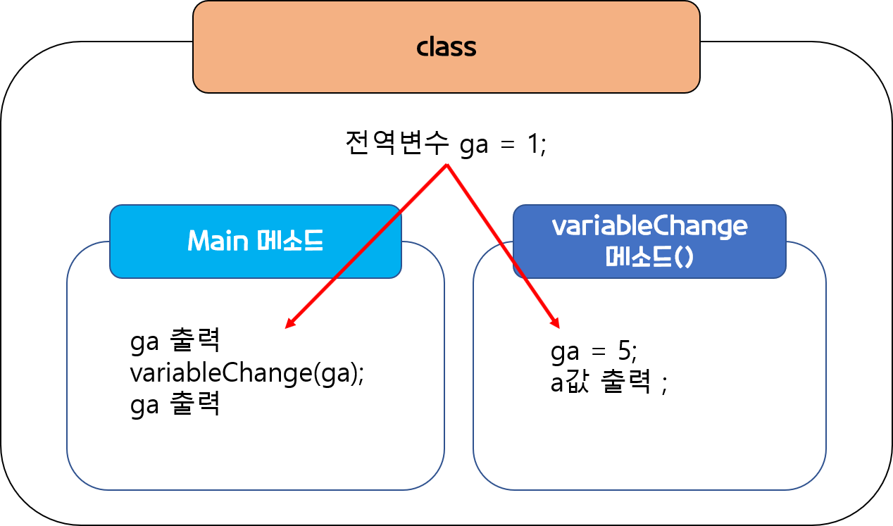

# 변수
- 변수는 어떤 단일데이터를 담을 수 있는 메모리이다.     
- 그중, 자바에서의 변수는 담는 데이터가 어떠한 형태인지 타입을 지정해줘야한다. 
```
int i = 0; 
String str = "hellow";
boolean check = true; 
```
## 데이터 타입의 종류 
- 이러한 변수에 할당해주는 데이터타입은 크게 두가지로 나눌 수가 있다. 
  - Primitive type(기본 타입)  
  - Reference type(참조 타입) 
- (실질적으로는 위에 타입이 범위가 더 크고, 해당 타입별로 변수(가변)와 상수(불변)로 나누어지지만, 이번 글에서는 변수만 다루고자 한다.)  

<br></br>

## Primitive Type(기본 타입)
 - int, char, long ,double, boolen 과 같은 데이터 타입을 말한다.
 - 객체가 아닌 실제값이 저장되는 데이터 타입으로 Null값을 가질수 없다.
 - 선언시 초기화는 필수 이다.
```
 int a;     
 //선언만 해주게 되면, 사용시 'Unresolved compilation problem' 컴파일 문제가 발생하고 
 // 변수를 초기화하라고 에러메시지가 뜬다.
 
 int a = null ;  //똑같이 컴파일 에러 발생
 // 변수값에 null값을 넣을 수 없다고 에러메시지가 뜬다. 
 
int a = 0  //올바른 값 

 ```
  - 스택영역 메모리에 저장되기에, 선언된 구역외에서는 사용할수 없다. 
  - 데이터로 바로 접근하여 사용하기때문에 접근 속도가 빠르다.
  - 기본타입형들은 소문자으로만 이루어져있고, Wrapper class로 객체행태로 바꿔줄수 있는데
    - java는 기본적으로 바꿔준다.
    
```
int primitive = 3 ;
Integer object =  primitive; // 자동으로 박싱을 해준다.
// 물론 이 반대도 가능하다.
```
<p></p>

### 기본 타입 종류
 - 크게 3가지로 나눌수 있다. 
    - 정수 타입 : byte, **char**, short, **int , long**
    - 실수 타입 : float , **double**
    - 논리 타입 : **boolean**


## Reference Type(참조 타입)
 - 다른 말론 객체 타입(Object Type)이라고도 하는데, 그 이유가 참조형은 **기본적으로 java.lang.Object를 상속**받는다.
 - 참조타입은 객체가 있는 위치를 저장한다.
 - class , Interface, Arrays, Collectoions 등 보통 기본형을 제외한 나머지 데이터타입들이다.
 
 - 참조타입은 하나의 인스턴스이기 때문에, 스택영역에는 참조값만 있고, 실제값들은 힙 메모리에 존재한다.  
```
// 예를 들어 class Student 라는 클래스를 새로 만든다고 가정했을때 
Student s = new Student();
// 여기서 새로 생성한(인스턴스) s 는 스택 메모리 영역에 저장되고,
// 원래 실제값(객체)인 class는 힙 메모리 영역에 저장된다.
```
- 값을 필요로 할 때마다 언박싱 과정을 거치기 때문에 Primitive타입과 비교해서 접근속도가 느린편이다. 
- primitive type과 구분하기 위해 데이터 타입 시작할때 첫글자는 대문자로 이루어져있다. 
- **엄청 큰숫자를 복사해야하는 경우, 혹은 넘겨줘야하는 경우 참조값만 넘길수 있는 참조타입이 좋을 수 있다.** 


### 참조타입 종류  
 - 크게 4가지로 나눌수 있다. 
    - 배열타입 : int[], char[], double[], boolen[] 등 
      - 기본타입을 인덱스에 맞춰 담을 수 있는 배열을 말한다.  
    - 열거타입 : enum  
    - 인터페이스 : collections 인터페이스 _ List<E>, set<E>, Map<E>
      - 여기서 E는 오브젝트를 말한다.
      - 지정된 틀이 필요한 경우 사용한다.
      - queue<E>
    - 클래스 : collections 클래스, class 클래스명
      - ArrayList, LinkedList, stack
      - HashMap, HashSet
      - 보통 개발자가 직접 만들어 필요한 타입이 있는 경우 사용한다. 
   
  
# 헤깔릴 수 있는 영역
  - 내가 가장 헤깔려 했던 개념중 하나가 메소드 혹은 클래스 내부변수와 외부변수이다. 
  - 왜냐면, 이것또한, primitive type과 reference 타입의 데이터 저장 방법이 다르기 때문이다. 
 
## primitive type 변수와 메소드 관계 
### 1. main 메소드안에 일반타입 변수 
```
public class test{
  public static void main(String[] args) {
  int a = 4;
  System.out.println("메소드 전용 전 변수 출력 : " + a);
  variableChange(a);
  System.out.println("메소드 전용 후 변수 출력 : " + a);
  }
  public static void variableChange(int a){
    a =3 ;
    System.out.println("메소드 안 변수 출력 : " + a);
  }
}  

```
  
- 결과   
> 메소드 전용 전 변수 출력 : 4   
> 메소드 안 변수 출력 : 3   
> 메소드 전용 후 변수 출력 : 4   
  

      
  - 메소드안에서 생성한 기본데이터타입은 다른 메소드의 인자로 넣어 넘겨줘도, 해당 메소드에서는 값을 바꿀수가 없다.
  
   
  
---
### 2. main 메소드안에 참조타입(객체)변수 
```
public class test2{
  public static void main(String[] args) {
  int[] a = {1,2,3,4};
  System.out.println("메소드 전용 전 배열 출력 : " + Arrays.toString(a));
  variableChange(a);
  System.out.println("메소드 전용 후 배열 출력 : " + Arrays.toString(a));
  }
  public static void variableChange(int[] a){ // 여기서 참조타입인 배열 자체를 인자로 넣어줘야한다.
    a[0] = 5 ;
    System.out.println("메소드 안 배열 출력 : " + Arrays.toString(a));
  }
}  
```
  
- 결과   
> 메소드 전용 전 배열 출력 : [1, 2, 3, 4]   
> 메소드 안 배열 출력 : [5, 2, 3, 4]   
> 메소드 전용 후 배열 출력 : [5, 2, 3, 4]   
  
    - 메소드안에서 생성한 참조 타입 변수는 다른 메소드의 인자로 참조 타입 데이터를 넘겨주기 때문에,
    - main 메소드안의 a 값과  method안에 a값은 같은 배열을 가르키고 있는 것이 된다.
    - 그렇기 때문에, 메소드에서 배열 내부값을 바꾸면 다른 메소드에도 영향이 가게된다.
    - 이것은 다른 참조타입(객체)도 동일하다.
  
   

  ---
### 3. 전역변수
  - 그럼 자칫 참조타입의 역할이 전역변수와 헤깔릴수 있는데, 엄연히 다르다.
  - 전역변수의 경우 선언한 곳 안에서는 어디든지 불러올 수 있기 때문에, 굳이 인자로 넣어 줄 필요도 없다. 
  
```
public class test2{
  static int gv= 4;
  public static void main(String[] args) {
  		System.out.println("메소드 적용 전 전역 변수  : "+ga);
      variableChange(); // 인자가 필요없음
      System.out.println("메소드 적용 전 전역 변수  : "+ga);
  }
  public static void variableChange(){ 
    ga = 5 ;
    System.out.println("메소드 안 전역변수 : " + ga);
  }
}
```
- 결과   
> 메소드 전용 전 전역 변수 : 4   
> 메소드 안 전역 변수 : 5   
> 메소드 전용 후 전역 변수 : 5   
   
  - 하지만, 이 방식은 어디에서든 접근이 가능한 것이기에 안정성이 떨어져, 확실한 경우가 아니라면 굳이 사용하지 않는 방법이기도 하다.

  
