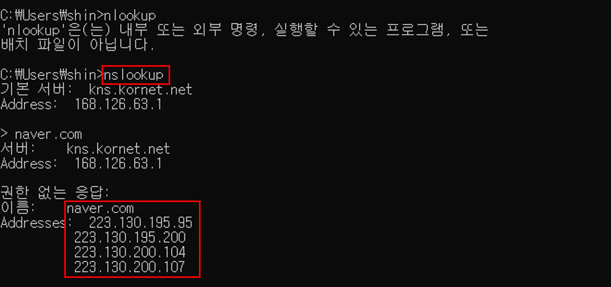

# DNS 작동원리?

 ## DNS?
 먼저 DNS의 사전적인 정의부터 알아보자
 > DNS는 도메인 네임 시스템(Domain Name System)은   
 > 호스트의 도메인 이름을 호스트의 네트워크 주소로 바꾸거나 그 반대의 변환을 수행할 수 있도록 하기위해 개발되었다. 
(출처 : 위치백과)

예를 들어 우리가 자주 접하는 naver.com, daum.net, google.com 모두 DNS라고 할 수 있다.   
사실 이들의 본모습은 IP인데
cmd에서 nslookup 명령어를 통해 해당 url의 ip주소를 알 수 있다. 

