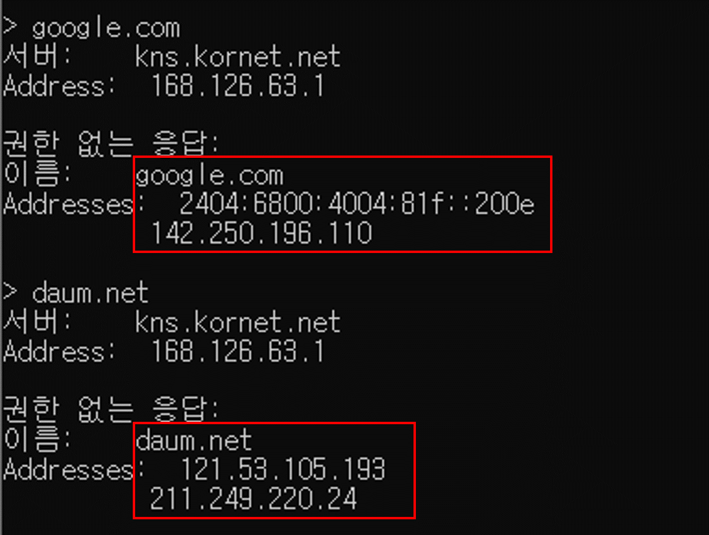
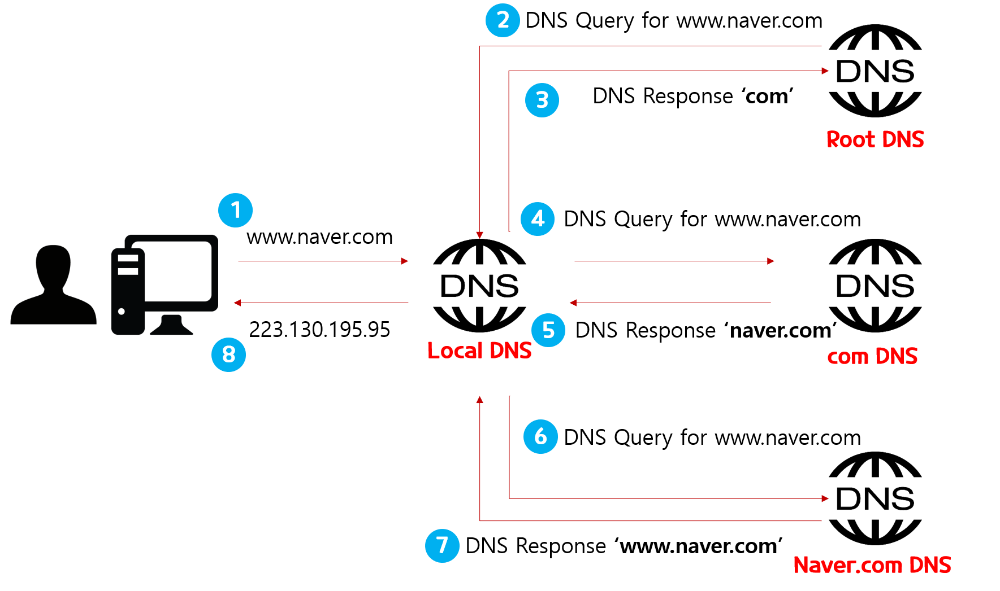
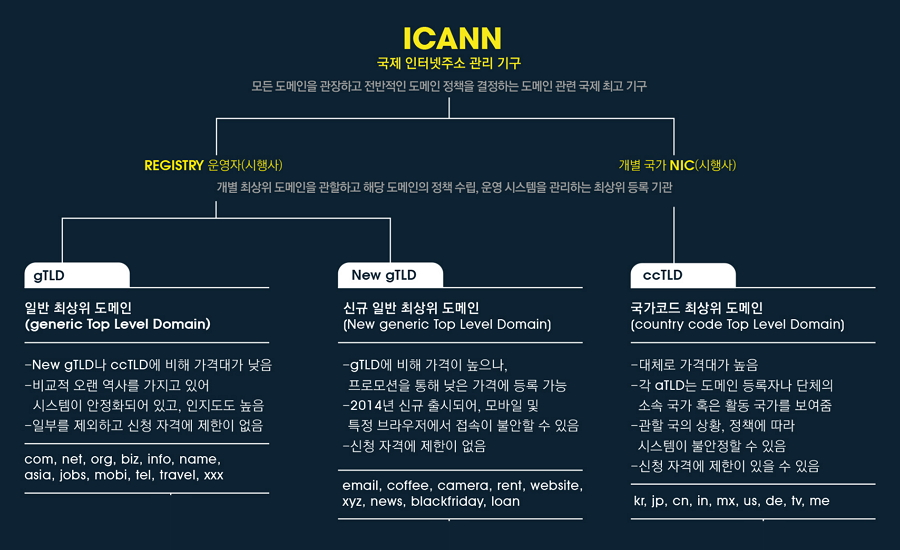

# DNS 작동원리?

 ## DNS?
 먼저 DNS의 사전적인 정의부터 알아보자
 > DNS는 도메인 네임 시스템(Domain Name System)은   
 > 호스트의 도메인 이름을 호스트의 네트워크 주소로 바꾸거나 그 반대의 변환을 수행할 수 있도록 하기위해 개발되었다. 
(출처 : 위치백과)

  
예를 들어 우리가 자주 접하는 naver.com, daum.net, google.com 모두 DNS라고 할 수 있다.   
사실 이들의 본모습은 IP인데
cmd에서 nslookup 명령어를 통해 해당 url의 ip주소를 알 수 있다. 

- 네이버
[223.130.195.95](https://223.130.195.95) ,
[223.130.195.200](https://223.130.195.200) ,
[223.130.200.104](https://223.130.200.104) ,
[223.130.200.107](https://223.130.200.107) 
  

 
 - 구글
[142.250.196.110](https://142.250.196.110)   

 - 다음
[121.53.105.193](https://121.53.105.193)

     

## DNS의 작동원리
 총 8과정으로 예를 들어보자 
 

 1. 웹브라우저에서 www.naver.com을 입력하면 먼저 LocalDNS에게  IP 주소를 질의하여,   
    Local DNS에 없으면 다른 DNS name 서버 정보를 받는다.(Root DNS 정보 전달 받음)
    - Root DNS란?
       - 인터넷의 도메인 네임 시스템의 루트 존이다. 루트 존의 레코드의 요청에 직접 응답하고 적절한 최상위 도메인에 대해 권한이 있는 네임 서버 목록을 반환함으로써 다른 요청에 응답한다. 전세계에 961개의 루트 DNS가 운영되고 있다.
 2. Root DNS 서버에 질의 
 3. Root DNS 서버로 부터 'com 도메인'을 관리하는 TLD(Top-Level Domain)이름 서버 정보 전달을 받는다.
    > 여기서 TLD는 .com을 관리하는 서버를 칭함
 4. TLD에 질의
 5. TLD에서 "naver.com"관리하는 DNS 정보 전달
 6. "naver.com" 도메인을 관리하는 DNS 서버에 "www.naver.com" 호스트네임에 대한 IP주소 질의
 7. Local DNS서버에게 찾은 IP 주소(223.130.195.95)를 응답 
 8. Local DNS는 www.naver.com에 대한 IP 주소를 캐싱하고 IP 주소 정보 전달   
 
  

 

