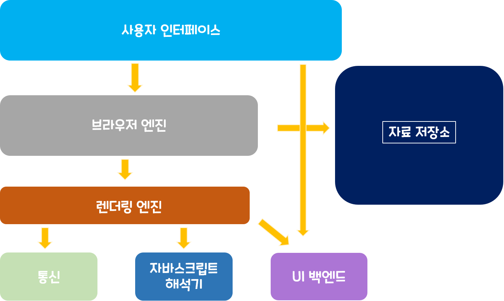

# 브라우저의 동작원리
브라우저는 우리가 가장 많이 사용하는 소프트웨어일 것이다.   
브라우저에도 익스플로러, 사파리, 크롬, 오페라 같이 여러 종류의 브라우저가 있으며,   
그중 크롬,사파리 같은 오픈소스 브라우저를 예를 들어 알아보고자 합니다.   

<br></br>
   
## 브라우저의 주요 기능✔
 - 사용자가 선택한 자원을 서버에 요청하고 브라우저에 표시하는 것 
 - 자원의 주소는 URL에 의해 정해진다. 
 - 자원은 HTML, PDF, 이미지 혹은 다른 형태이다. 

브라우저는 HTML과 CSS명세에 따라 해석해서 표시하는데 W3C(World Wide Web Consortium)에서 정한다.
과거에는 일부만 따라 구현했어가지고, 호환성의 문제를 많이 겪었지만, 최근에는 대부분의 브라우저가 표준 명세를 따른다고 합니다.

그래서 브라우저의 사용자 인터페이스가 서로 닮아 있는게 일반적입니다. 
 - URL를 입력할 수 있는 주소 표시 줄 
 - 이전 버튼과 다음버튼◀ ▶
 - 북마크 ⭐
 - 새로고침버튼과 현재 문서의 로드를 중단할수 있는 정지 버튼🔁
 - 홈버튼🏚 
   
 <br></br>
   
## 브라우저의 기본 구조〽
 1. 사용자 인터페이스 - 주소 표시줄, 이전/다음버튼, 북마크메뉴 등과 같이 요청한 페이지를 보여주는 창을 제외한 나머지 모든 부분
 2. 브라우저 엔진 - 사용자 인터페이스와 렌더링 엔진 상이의 동작을 제어
 3. 렌더링 엔진 - 요청한 콘텐츠를 표시. HTML을 요청하면, HTML과 CSS를 파싱하여 화면에 표시함
 4. 통신 - HHTP요청과 같은 네트워크 호출에 사용됨. 이것은 독립적인 각 플랫폼 하부에서 실행됨
 5. UI백엔드 - 콤보박스 혹은 드롭다운 창 같은 기본적인 장치를 그림. 플랫폼에서 명시하지 않은 일반적인 인터페이스로써, OS가 가지고 있는  사용자 인터페이스 체계를 사용합니다.
 6. 자바스크립트 해석기 - 자바스크립트 코드(JS 파일)를 해석하고 실행.
 7. 자료 저장소 - 이 부분은 자료를 저장하는 계층. 쿠키를 저장하는 것과 같이 모든 종류의 자원을 하드 디스크에 저장할 필요가 있습니다. HTML5에서는 브라우저가 지원하는 ***웹 데이터 베이스*** 가 정의되어 있음   
<p align="center"></p>


## 렌더링 엔진✏
- 렌더링 엔진의 역할은 요청 받은 내용을 브라우저 화면에 표시하는 일!(HTML, CSS)

- 렌더링 엔진은 HTML및 MXL문서와 이미지를 표시할 수 있습니다.    
   - (물론 플러그인이나 브라우저 확장기능을 이용하여 PDF와 같은 다른 유형도 표시할 수 있다)

- 렌더링 엔진 종류 
   - 게코 엔진(Gecko) - 파이어 폭스
   - 웹킷 엔진(Webkit) - 사파리, 크롬   
    
  <br></br>   
  
## 렌더링 엔진의 동작과정📈
<p align="center"></p>
렌더링 엔진은 통신으로부터 요청한 문서의 내용을 얻는 것으로 시작하는데   
모든 HTML을 파싱할 때까지 기다리지 않고,받은 내용의 일부를 먼저 배치와 그리기 과정을 시작한다.(인터프리터)
문서의 내용은 보통 8KB단위로 전송된다.   
  
#### 1. HTML 마크업을 처리하여 DOM 트리를 생성한다.
#### 2. CSS 마크업을 처리하여 CSSOM 트리를 생성한다.
#### 3. DOM트리와 CSSOM 트리를 결합하여 렌더링 트리 생성한다. 
#### 4. 렌더링 트리 배치(각 노드에 대해 화면에서의 정확한 위치와 크기를 계산)
#### 5. 렌더 트리 그리기 (UI 백엔드에서 렌더링 트리의 각 노드를 가로지르며 렌더링한다.)
---
#### 설명 
 - 렌더링 엔진은 HTML 문서를 파싱하고 "콘텐츠 트리" 내부에서 태그를 **DOM 노드**로 변환한다(1번)
 - 다음 외부 CSS 파일과 함께 포함된 스타일 요소도 파싱한다(2번)
 - 스타일 정보와 HTML 표시 규칙은 "렌더 트리"라고 부르는 또 다른 트리를 생성한다.(3번)
 - 렌더 트리는 색상 또는 면적과 같은 시각적 속성이 있는 사각형을 포함하고 있는데 정해진 순서대로 화면에 표시된다.(4번)
 - 렌더 트리 생성이 끝나면 배치가 시작되는데 이것은 각 노드가 화면의 정확한 위치에 표시되는 것을 의미한다. 다음은 UI 백엔드에서 렌더 트리의 각 노드를 가로지르며 형상을 만들어 내는 그리기 과정이다.(5번)


#### 예시   

 - 웹킷 동작 과정 
<p align="center"></p>

 <br></br>
 - 모질ㄹ의 게코 렌더링 엔진 동작 과정
<p align="center"></p>

<br></br>
---
## 1.DOM(Document Object Model)트리 생성 🌲

```
<!DOCTYPE html>
<html>
  <head>
    <meta name="viewport" content="width=device-width,initial-scale=1">
    <link href="style.css" rel="stylesheet">
    <title>Critical Path</title>
  </head>
  <body>
    <p>Hello <span>web performance</span> students!</p>
    <div></div>
  </body>
</html> 
```

<p align="center"></p>

HTML페이지는   
바이트 문자 변환 -> 토큰화 -> 노드로 변환 ->DOM트리 생성 과정을 거치게 된다.   
DOM 트리는 렌더링될 때 어떻게 표시할지는 알려주지 않는데, 그 정보는 CSSOM이 알려준다.   

<br></br>

## 2. CSSOM(CSS Object Model)트리 생성 🌲
브라우저가 DOM을 생성하는 동안 <hea>섹션에서 style.css를 참조하는 문서의 링크 태그를 만나게 된다.   
브라우저는 이 리소스에 대한 처리를 요청하고, 요청의 결과는 다음과 같다.
```
body { font-size: 16px }
p { font-weight: bold }
span { color: red }
p span { display: none }
img { float: right } 
```
<p align="center"></p>

CSS 또한 HTMl과 마찬가지로, 바이트를 문자로 변환 ->토큰화 -> 노드로 변환 -> CSSOM 트리 구축 과정을 거치게된다. 
   - 그럼 굳이 CSSOM이 트리 구조를 갖는 이유?
      - 스타일은 하향식으로 규칙을 적용하게 된다. 페이지의 객체에 있는 스타일을 계산할 때, 브라우저는 해당 노드에 적용 가능한 가장 일반적인 규칙에서 더욱 구체적인 규칙을 적용한다.
   - 위의 트리는 완전한 CSSOM 트리가 아니다.
      - 브라우저가 기본적으로 제공하는 user agent style에서 스타일 시트가 재정의 하도록 결정한 스타일만 표시한다.
   
<br></br>
## 3.렌더링 트리 생성🌲
<p align="center"></p>
 - 먼저 DOM트리와 CSSOM 트리를 결합하여 렌더링 트리를 형성한다.
 - 렌더링 트리에는 페이지를 렌더링하는데 필요한 노드만 포함된다.
 - 렌더링 트리는 페이지에 표시되는 모든 DOM 컨텐츠와 각 노드에 대한 모든 스타일 정보를 갖고 있다.   

<br></br>   

## 4.렌더 트리 배치 -레이아웃 ⬜
 - **뷰포트 내에서 노드의 정확한 위치와 크기를 계산한다.** 
 - 페이지 내에서의 각 객체의 정확한 위치와 크기를 계산하기위해, 브라우저는 렌더링 트리의 루트에서 시작하여 트리를 순회한다. 
 - 레이아웃 과정의 결과는 Box Model 이다. 박스 모델은 뷰포트 내에서 각 노드의 정확한 위치와 크기 정보를 담고 있다. 모든 상대적인 측정값은 화면에서 **적대적인 픽셀**로 변환된다.

<br></br>   

## 5.렌더 트리 그리기 ✍ - 'painting' or 'rasterizing'
마지막으로, 렌더링 트리의 각 노드를 화면에서의 실제 픽셀로 변환한다. 

