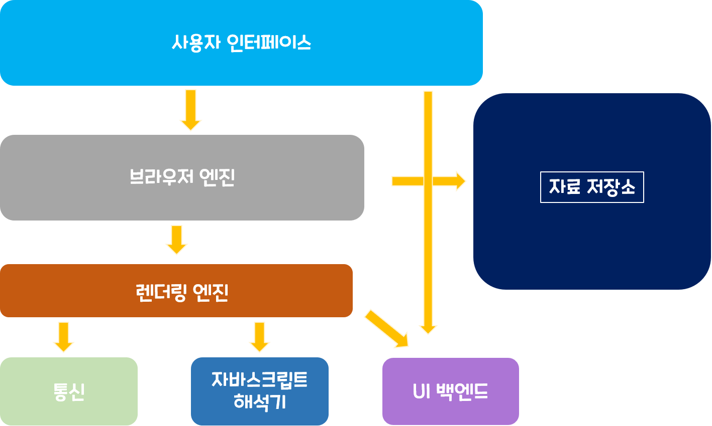

# 브라우저의 동작원리
브라우저는 우리가 가장 많이 사용하는 소프트웨어일 것이다.   
브라우저에도 익스플로러, 사파리, 크롬, 오페라 같이 여러 종류의 브라우저가 있으며,   
그중 크롬,사파리 같은 오픈소스 브라우저를 예를 들어 알아보고자 합니다.   

  
   
## 브라우저의 주요 기능✔
 - 사용자가 선택한 자원을 서버에 요청하고 브라우저에 표시하는 것 
 - 자원의 주소는 URL에 의해 정해진다. 
 - 자원은 HTML, PDF, 이미지 혹은 다른 형태이다. 

브라우저는 HTML과 CSS명세에 따라 해석해서 표시하는데 W3C(World Wide Web Consortium)에서 정한다.
과거에는 일부만 따라 구현했어가지고, 호환성의 문제를 많이 겪었지만, 최근에는 대부분의 브라우저가 표준 명세를 따른다고 합니다.

그래서 브라우저의 사용자 인터페이스가 서로 닮아 있는게 일반적입니다. 
 - URL를 입력할 수 있는 주소 표시 줄 
 - 이전 버튼과 다음버튼◀ ▶
 - 북마크 ⭐
 - 새로고침버튼과 현재 문서의 로드를 중단할수 있는 정지 버튼🔁
 - 홈버튼🏚 
   
   
   
## 브라우저의 기본 구조
 1. 사용자 인터페이스 - 주소 표시줄, 이전/다음버튼, 북마크메뉴 등과 같이 요청한 페이지를 보여주는 창을 제외한 나머지 모든 부분
 2. 브라우저 엔진 - 사용자 인터페이스와 렌더링 엔진 상이의 동작을 제어
 3. 렌더링 엔진 - 요청한 콘텐츠를 표시. HTML을 요청하면, HTML과 CSS를 파싱하여 화면에 표시함
 4. 통신 - HHTP요청과 같은 네트워크 호출에 사용됨. 이것은 독립적인 각 플랫폼 하부에서 실행됨
 5. UI백엔드 - 콤보박스 혹은 드롭다운 창 같은 기본적인 장치를 그림. 플랫폼에서 명시하지 않은 일반적인 인터페이스로써, OS가 가지고 있는  사용자 인터페이스 체계를 사용합니다.
 6. 자바스크립트 해석기 - 자바스크립트 코드(JS 파일)를 해석하고 실행.
 7. 자료 저장소 - 이 부분은 자료를 저장하는 계층. 쿠키를 저장하는 것과 같이 모든 종류의 자원을 하드 디스크에 저장할 필요가 있습니다. HTML5에서는 브라우저가 지원하는 ***웹 데이터 베이스*** 가 정의되어 있음   

