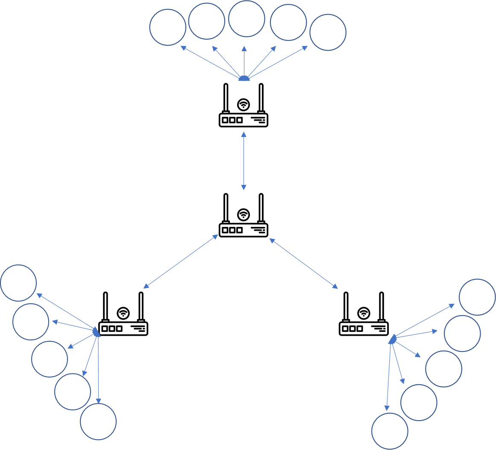
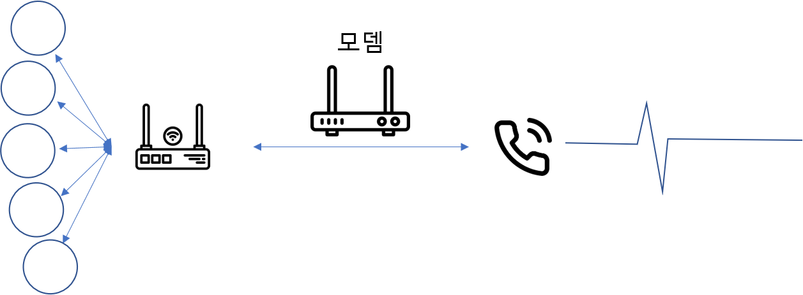
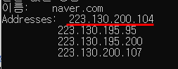

# 인터넷의 동작원리?

우리가 흔히 쓰고 있는 인터넷은 생각보다 복잡하게 구성되어 있습니다.

## 내가 생각하던 인터넷

두개의 컴퓨터가 통신이 필요할 떄, 다른 컴퓨터와 물리적(케이블이나 이더넷 같은 거)으로  
혹은 무선(wifi 혹은 Bluetooth같은 시스템)으로 연결되어 있어,  
서로 메일을 주고받거나 통신하는 등 형태로 생각했습니다.

---

## 컴퓨터들간의 연결 네트워크

 - 하지만,이러한 네트워크는 보통 두대의 컴퓨터로만 연결되어 있지 않습니다.  
 - 게임을 하든, 서로 카톡을 하든 단둘이 아닌 여럿이서 연결을 하기해 원하는 만큼의 컴퓨터를 연결할 수가 있죠.  
 - 하지만, 연결이 많아 질수록 매우 복잡해집니다.

> 예를 들어 10대의 컴퓨터를 연결하려는 경우  
> 컴퓨터당 9개의 플러그가 달린 45개의 케이블이 필요합니다.

 - 모두연결하기위해선(9+8+7+6+5+4+3+2+1),이렇게 많은 케이블이 쓰이는데, 10개가 아닌 100개~천개 등은 훨씬 더 복잡해집니다.

---

## 라우터

 - 그래서 이러한 문제를 해결하기 위해 네트워크의 각 컴퓨터는 라우터라고 하는 특수한 소형 컴퓨터를 만듭니다.

- 라우터는 단 하나의 작업만 하는데 **경로설정** 입니다.

- 통신을 보내는 컴퓨터의 정보가 올바른 대상 컴퓨터에 잘 가는지 확인하는 장치입니다.

- 예를 들어
> 컴퓨터A가 컴퓨터B 에게 메시지를 보내려고 하면,   
> 컴퓨터 A는 라우터에게 보내야하고, 라우터는 컴퓨터B로 전달하고,   
> C와 같은 다른 컴퓨터에게는 전달되지 않도록 하는 역할을 합니다.

 - 여기서 주의할 점은 공유기랑 헤깔릴 수 있는데...  
    - 공유기의 경우는 하나의 공인 IP를 사설 IP로 분배해주는 것이고,  
    - 라우터는 보내고 받는 일을 하는 것이다.

 - 즉, 쉽게 말해 **`공유기`는 분배**에 초점을 맞춘 장치이고, **`라우터`는 전달**에 초점을 맞춘 장치이니 엄연히 다른 장치임을 알고 있으시면 됩니다.

--- 
하지만,라우터도 한계가 있었습니다.  
컴퓨터가 점점 늘어나면서, 수천,수십억대의 컴퓨터를 연결해야되다 보니까.

#### 라우터와 라우터끼리 연결하면서 해결해 갔습니다.

 - 라우터도 소형 컴퓨터이기에 무한히 확장할 수도 있지요.

 - 이렇게 우리가 인터넷이라고 부르는 것에 가까워졌지만, 아직 부족한 것이 있습니다.  
 - **라우터에 연결된 사람들만 네트워크를 구축했다는 것이죠.**

---

## ISP의 등장

- 이점은, 라우터를 가지고있지 못하거나, 가지고 있더라도 라우터끼리 연결되지 않은 경우, 혹은 아주 먼 곳에 위치하여 케이블을 연결할 수 없는 경우 등  
- 모든 컴퓨터에 인터넷을 연결하기에는 한계가 있었죠.  
> 그래서 이 문제를 해결하기위해, **전화배선**을 이용합니다.

  

- 전화 배선은 왠만한 모든 집에 이미 설치가 되어 있고, 전력도 갖추고 있기때문에  
   - 전화기 배선은 완벽하다고 할 수 있었죠.  
- 그래서 전화 시설과 네트워크가 연결을 합니다.  
   - 물론, 서로 용도가 달랐기에, 호환되기위한 모뎀이라는 특수 장비가 필요했고요.

> 그래서 네트워크는 전화시설에 연결이 됩니다.

  
 - 이렇다보니, 기업뿐만 아니라, 개인이나 단체등에서도 인터넷을 사용이 가능해졌고,  
 - 커다란 기업의 경우는 내부적으로 라우터관리가 가능하지만,  
 - 개인이나 단체 혹은 작은 기업의 경우에는 라우터를 관리해줄 곳이 필요로 해졌습니다.

  

그래서 `인터넷 서비스제공업체(Internet Service Provider, ISP)`에 모두가 연결를 하게 되었고,  
ISP는 많은 연결을 담당하는 몇몇 특수한 라우터를 관리하고 다른 ISP의 라우터에도 접근 할 수 있는 회사가 만들어 집니다.

- ISP의 대표적인 회사론 KT, SKT, LG U+ 와 같은 회사입니다.  
  - 그래서 이제는 개인이 ISP를 이용하여, 해외 먼곳도 ISP의 접근이 가능해 메세지를 보낼수 있게 되죠.

---

### 컴퓨터 찾기

> 위 사진 처럼 특정 컴퓨터에서 다른 특정 컴퓨터를 찾기위해서는 고유한 이름을 적어줘야 찾을 수 있습니다.  
> 네트워크에 연결된 모든 컴퓨터들은 **IP 주소라는 고유한 주소**가 있는데 이것을 이용하여 찾습니다.

-   예시IPv4 192.168.2.10

  

IP 주소를 이용하면 다른 컴퓨터를 찾아가는데는 문제가 없습니다. 다만,일일이 IP 주소를 기억하기가 어려울 뿐이죠.  
마치 전화하려면 핸드폰 번호 010-1234-5678를 외워야하지만, 핸드폰에 그 사람 이름으로 저장해놓으면,  
그 사람 이름으로 찾기 쉬워지는 것처럼 **IP주소도 이름을 지정 할 수가 있습니다.**

-   223.130.200.104 (네이버IP 2022/03/27기준)  

-   [www.naver.com](http://www.naver.com)

 - 둘다 url 에 입력해보면 네이버창이 뜰것입니다.  
 - 위에 숫자는 IP주소라고하고, 밑에 naver.com은 도메인 이름이라고 합니다.
 - 덕분에 웹 브라우저를 탐색할 때 일반적으로 도메인 이름으로 웹사이트에 접속합니다.

---

### 인터넷과 웹

우리는 `인터넷`이라는 말과 `웹`이라는 말은 혼용해서 쓰고 있는데,  
이것은 과연 같은 것을 의미일까요??  
반은 맞고 반은 틀렸다고 할 수 있습니다.

위에서 보았듯이 **인터넷은 수십억 대의 컴퓨터를 모두 연결하는 기술 인프라 입니다.**  
이러한 컴퓨터들 중에 일부는 "웹서버" 로서 웹 브라우저가 이해할 수 있는 서비스를 제공합니다.  
정리하자면

-   인터넷은 **인프라**
-   웹은 그 **인프라 기반 위에 구축된 서비스**

웹뿐만아니라, 인터넷 위에 구축된 다른 이메일,IRC와 같은 서비스들도 있습니다.

그럼 다음 백엔드로드맵과정으로 넘어가겠습니다~
