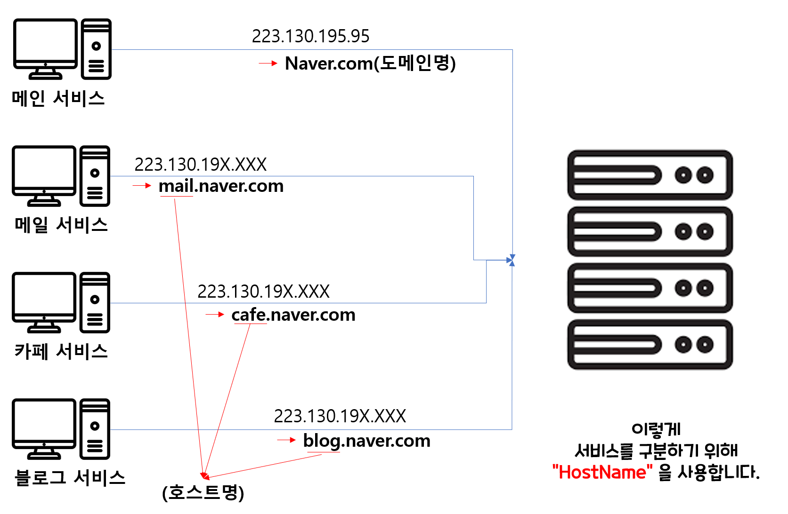

#DOmainName and HostName?
도메인네임과 호스트네임은 은근히 같이 사용하면서도, 서로 의미가 달라 
얼추 알고 있다면 헤깔릴 수가 있다.(내가 그렇다.)

그래서 이번 기회에 개념을 확실히 잡고 가고자한다. 

## HostName(호스트명)
- Host 의 뜻은 "guest를 맞이하고 대접하는 사람"이라는 뜻으로 컴퓨터 서버이야기에 잘 맞는다.
- 옛 명칭으로는 nodeName(노드네임)이였다.
- 네트워크의 연결된 장치(컴퓨터, 파일서버, 복사기, 케이블 모뎀 등),네트워크가 연결되는 모두에게 부여되는 고유한 이름이다.
- DomainName(도메인 이름)과 유사하지만 엄밀히하게는 더 넓은 의미를 가진다

## HostName 특징
- 보통 사람이 잃고 이해할 수 있는 이름으로 지으며, 흔히 IP주소 나 MAC 주소와 같은 기계적인 이름 대신 쓸 수 있다. 
- NIS, DNS, SMB 등의 여러 체계에서 사용되기 때문에 네트워크에 따라서 **같은 컴퓨터라도 다른 호스트명**을 가지고 있을 수 있다. 
- 하지만, 통상적으로 대부분의 호스트명이라고하면 인터넷 상에서의 호스트명을 가르킨다.
- 인터넷상에서는 보통 해당 서비스의 역할에 따라 호스트네임을 정합니다. 
    - 예를 들어, naver.com에서 메일서비스를 들어가면 주소 이름이 mail.naver.com으로 됩니다.
    - 카페에 들어가면 cafe.naver.com이 됩니다.
    - 블로그에 들어가면, blog.naver.com이 됩니다. 
- 위에서 HostName은 mail, cafe, blog 입니다.

## DomainName(도메인명)
그럼 DomainName은 무엇일까요?
 - 위에 예시에서는 naver.com이 DomainName 입니다.
 - DNS에서 배웠다시피, 도메인 레지스트리에 **등록된 이름**을 의미합니다.
 - 넓은 의미로는 네트워크 상에서 컴퓨터를 식별하는 호스트명을 말합니다.

- HostName은 각 서버 또는 서비스의 영역을 구분하기위해 사용됩니다. 

