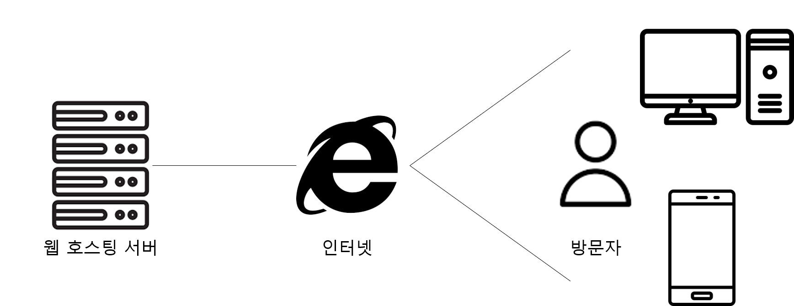
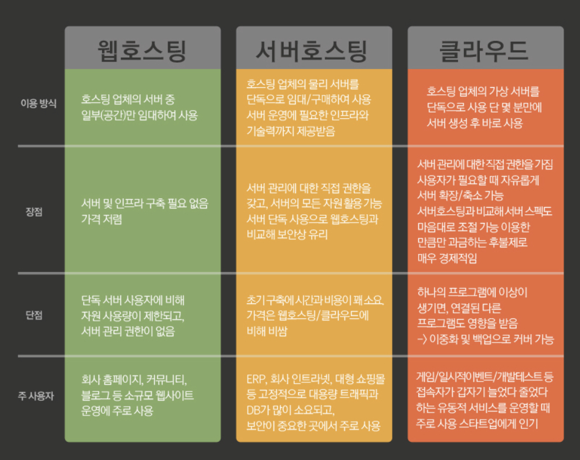

# 호스팅이란❓
- 어떤 서비스를 빌려서 사용한다는 말이다.
- 일반적으로 개인이나 단체가 만든 홈페이지를 외부에서도 사용할 수 있게 만들려면, 서버를 이용해야하고, 또다른 서버와 연결이 되어 있어야한다.
- 하지만, 개인이 24시간 상시로 서버를 켜놓고 관리하기에는 어려움이 있으므로, 전문적으로 서버를 운영하거나, 기업에게 일부를 빌려와
사용하는 작업을 호스팅이라고 부른다.
- 호스팅 서비스의 범위는 매우 다양한데, 기본 적으로 웹호스팅, 서버호스팅, 클라우드 호스팅과 같은 종류가 있다.   

  

대표적인 3가지 호스팅에 대해 알아보자
## 웹 호스팅📁

- 개인(혹은 단체)이 홈페이지를 올려놓을 인터넷상의 공간을 임대해주는 서비스
- 만든 홈페이지를 PC에만 저장해놓으면 PC사용자 외는 인터넷상에서 누구나 볼 수 없습니다. 
- 비유하자면, 다세대가 거주하는 빌라(웹서버)의 방한칸(홈페이지가 들어갈 공간)을 임대하여 사용하는 서비스라고 보시면 됩니다.
- 서버의 일부분만 사용하기에 저렴하지만, 사용량의 제한이 있다.

  

## 서버호스팅🗃

- 웹 호스팅은 서버중 일부만 빌리는 서비스라면 **서버 호스팅은 서버 하나를 통째로 구매하는 서비스** 이다.
- 서버운영에 필요한 인프라와 기술력까지 제공받을 수 있다. 
- 서버 관리 권한이 생기고, 단독으로 사용하기에 보안상에도 유리하여 소규모 웹사이트에 주로 사용된다. 
- 하지만, 초기 구축단계에서 웹호스팅에 비해 시간과 비용이 많이 든다는 단점이 있다. 
- 보통 회사의 인트라넷, 대형 쇼핑몰등 고정적으로 대용량 트래픽과 DB가 많이 사용되는 곳에서 사용된다.
 
   

 ## 클라우드 호스팅☁
 - 최근에 가장 많이 쓰이는 호스팅 방법
 - 웹호스팅의 장점과 서버호스팅의 장점을 모두 가지고 있는 호스팅이다.
    - 클릭 몇번으로 10분안에 누구나 서버를 생성하고 관리할 수 있으며, 트래픽의 관리 및 대처도 유연하게 가능
    - 그래서 일시적인 이벤트나 인프라가 유동적인 곳에 사용하기 편리하다는 장점   
 - 아마존의 EC2와 구글의 클라우드 플랫폼등 다양한 서비스가 존재

